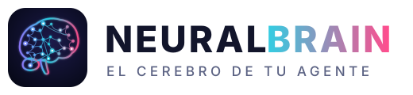
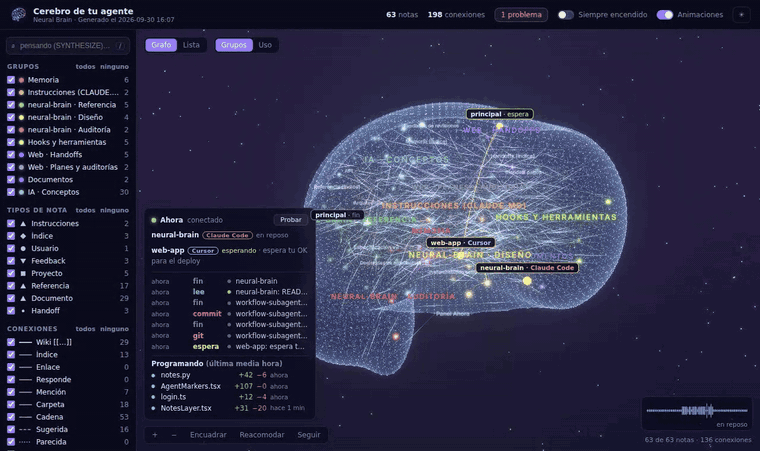
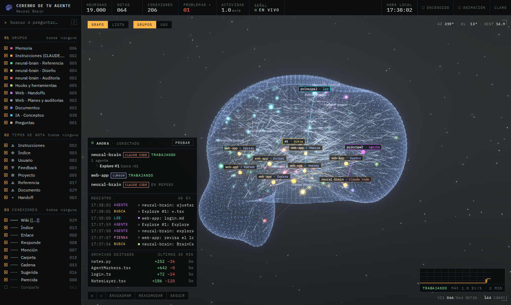
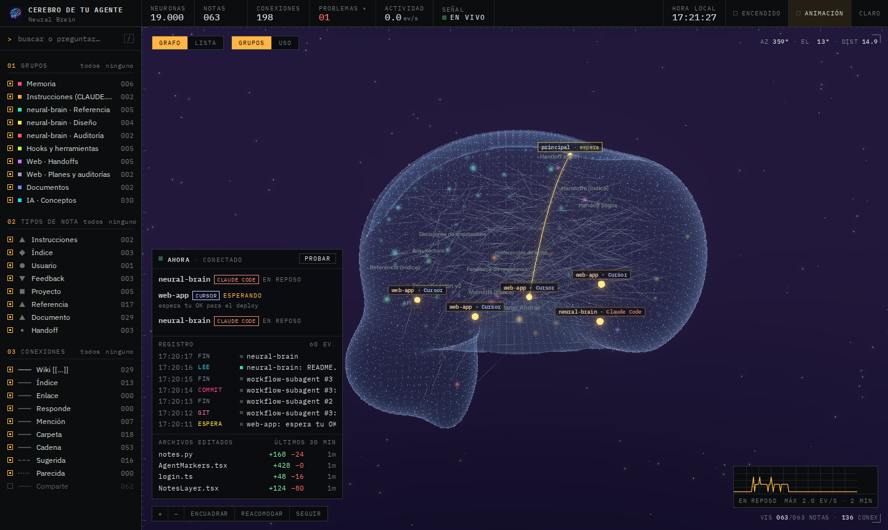
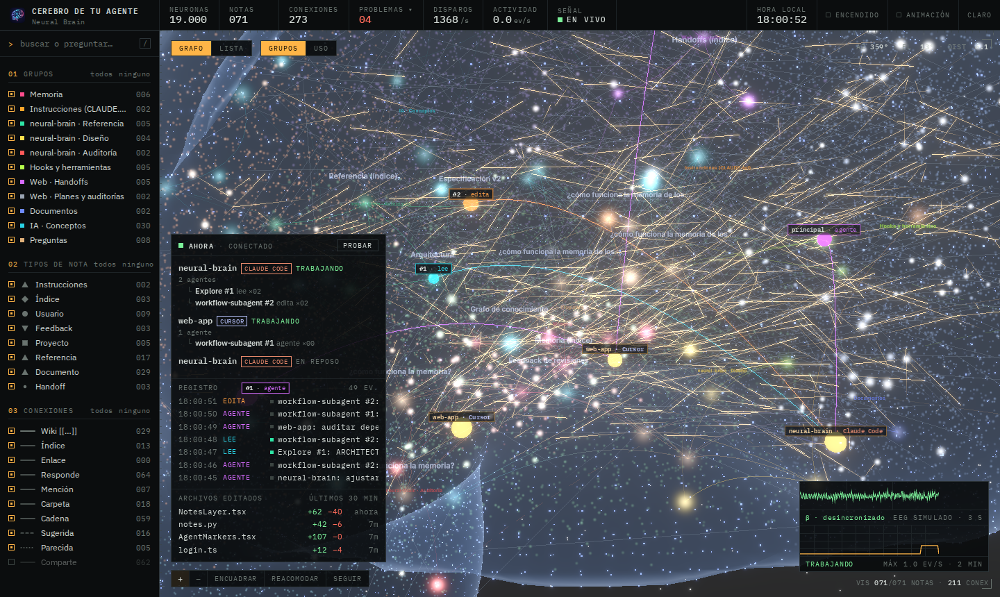
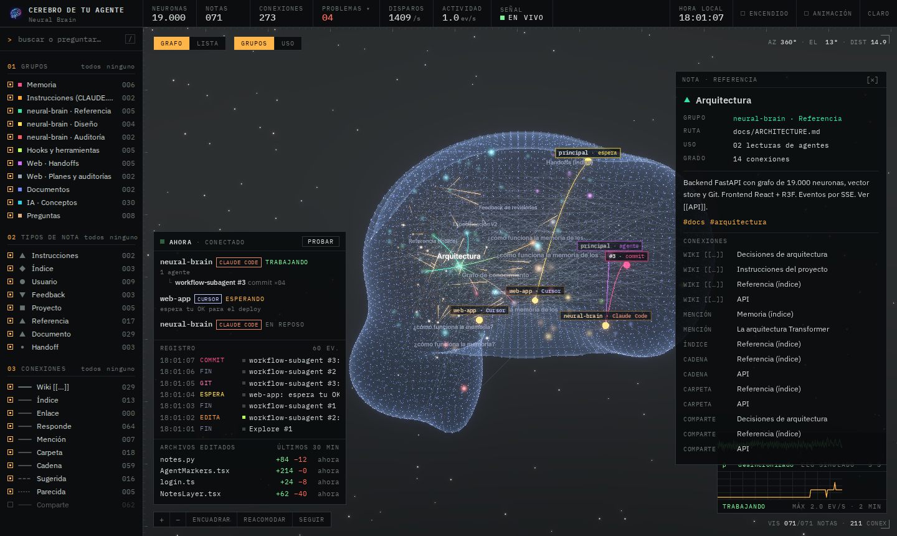
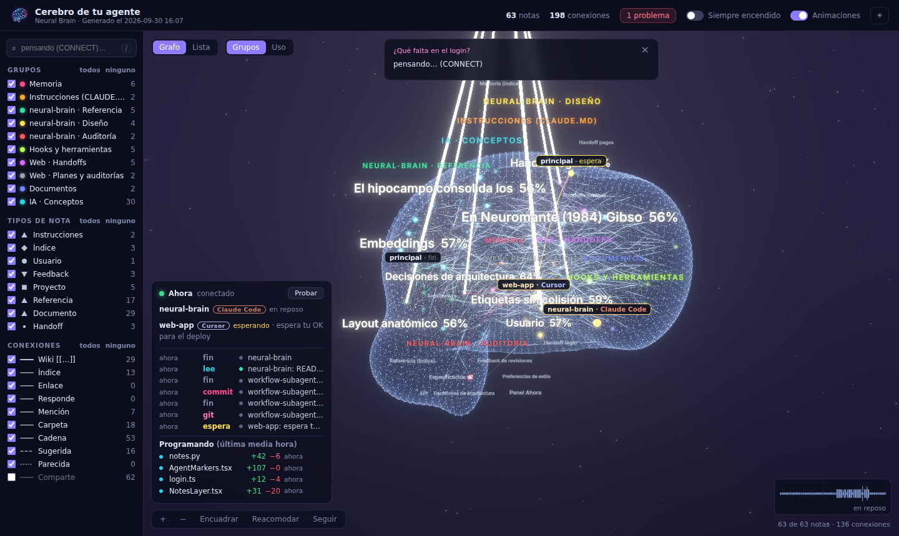
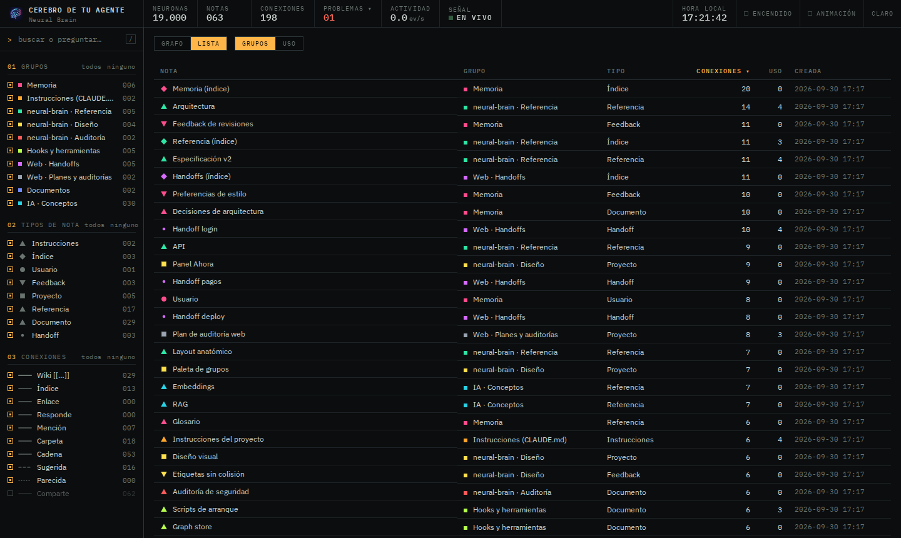
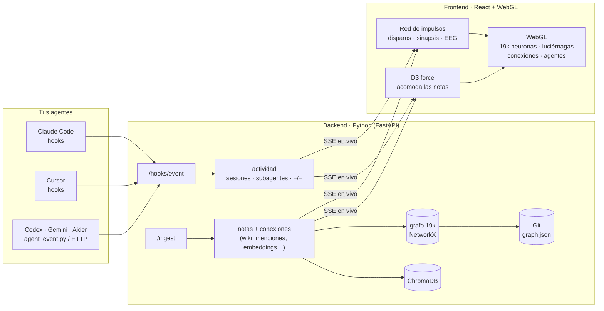

<div align="center">

<picture>
  <source media="(prefers-color-scheme: dark)" srcset="docs/brand/logo-dark.svg">
  
</picture>

### La memoria de tu agente de código, viva en un cerebro 3D.

Tus notas y la memoria de la IA se conectan solas y se acomodan como neuronas dentro de un cerebro de 19.000 puntos de luz.<br>
Cuando **Claude Code**, **Cursor**, **Codex** o cualquier otro agente trabaja, lo ves **pensar en tiempo real**.

<br>


**Agentes:** Claude Code · Cursor · Codex · Gemini CLI · Aider · cualquier script

[Qué es](#qué-es) · [Galería](#galería) · [Cómo funciona](#cómo-funciona) · [Instalación](#instalación) · [Conectar tu agente](#conectar-tu-agente) · [Uso](#uso) · [API](#api)

<br>



<sub>En reposo (EEG en alfa), luego Claude Code y Cursor trabajando a la vez y al final una pregunta: los impulsos recorren los axones desde el hipocampo hasta el lóbulo frontal y el alfa se bloquea.</sub>

</div>

---

## Qué es

**Neural Brain** convierte la memoria de tu agente de código en algo que puedes **ver**. Cada nota (instrucciones, `CLAUDE.md`, decisiones, handoffs, documentación…) es una neurona luciérnaga dentro de un cerebro anatómico. Las notas se conectan entre sí y se iluminan cuando un agente las lee, las busca o las edita. Por dentro funciona como un cerebro de verdad: una red de 19.000 neuronas que disparan, se propagan por sus sinapsis y se calman solas. Pregúntale algo y verás cómo recorre su memoria para responderte.

<table>
<tr>
<td width="50%" valign="top">

### 🧠 Un cerebro de verdad
19.000 neuronas como polvo luminoso dentro de un cerebro anatómico en vista lateral: frontal, parietal, temporal, occipital, hipocampo y cerebelo, unidas por 240 tractos de sustancia blanca. Tiene piel punteada de corteza, estrellas y bloom, todo en WebGL.

### ⚡ Funciona como uno
Las 19.000 neuronas forman una **red de impulsos**: cada una integra lo que le llega, dispara al cruzar el umbral, queda refractaria un momento y manda el impulso por sus sinapsis, con el retardo de la conducción. Ves los **potenciales de acción viajando por los axones** y por las fibras entre regiones, y una inhibición global evita que la actividad se desborde.

En reposo queda en penumbra, con disparos espontáneos que siguen una onda lenta, y el **EEG simulado** muestra ritmo alfa. Al pensar, el alfa se bloquea y la actividad se enciende. Cada acción de un agente recluta su área: leer va a la corteza visual y temporal, buscar al hipocampo, editar al frontal y compilar al cerebelo. Una pregunta viaja como en un cerebro: se lee, el hipocampo recupera las memorias, estas se asocian entre sí y convergen en el lóbulo frontal para componer la respuesta. Si lo prefieres siempre iluminado, hay un interruptor.

### ✨ Notas luciérnaga
Cada nota palpita a su propio ritmo con el color de su grupo, y su tamaño depende del tipo de nota. **D3** (`d3-force-3d`) las acomoda: las atraen sus conexiones y su grupo, y el mismo SDF del backend las mantiene dentro del cerebro.

</td>
<td width="50%" valign="top">

### 🕸 Se conectan solas
El backend detecta **10 tipos de conexión**: `[[wiki]]`, enlaces, índices, respuestas a preguntas, menciones, carpeta, cadena en el tiempo, etiquetas compartidas y vecinos semánticos (sugerida / parecida). También señala **problemas**: enlaces rotos, notas huérfanas y duplicados.

### 🤖 Cualquier agente, en vivo
Hooks para **Claude Code** (con subagentes) y **Cursor**, `notify` de **Codex** y un CLI/HTTP genérico para el resto. Cada sesión muestra su agente, sus subagentes (`#1 · busca`, `#2 · compila`…), las acciones y los archivos editados con **+/−** líneas.

### 🔎 Pregúntale
Escribe en el buscador y pulsa Enter. El cerebro busca por embeddings (ChromaDB) en cuatro fases (INPUT → SEARCH → CONNECT → SYNTHESIZE) que ves como tráfico neuronal: leer, recuperar del hipocampo, asociar y componer en el frontal. Con `ANTHROPIC_API_KEY`, Claude redacta la respuesta. Todo se versiona en **Git**.

### 📟 Un instrumento, no un dashboard
La interfaz se lee como un monitor de laboratorio: lecturas numéricas (neuronas, disparos por segundo, ev/s, señal), osciloscopio con el **EEG simulado** y la actividad de los agentes, registro con hora, reglas y lectura de cámara en el visor. Tipografía IBM Plex, un solo acento ámbar y tema claro de papel.

</td>
</tr>
</table>

## Galería

<table>
<tr>
<td width="50%"><br><sub><b>Trabajando.</b> Cada acción recluta su área y la actividad se propaga. Panel <i>Ahora</i> con sesiones, subagentes, acciones y archivos editados; el EEG pasa a beta.</sub></td>
<td width="50%"><br><sub><b>En reposo.</b> Penumbra, unos pocos disparos espontáneos que siguen una onda lenta y el EEG en ritmo alfa.</sub></td>
</tr>
<tr>
<td colspan="2"><br><sub><b>De cerca.</b> Cada trazo cálido es un potencial de acción viajando por un axón hasta su sinapsis; los destellos son neuronas disparando.</sub></td>
</tr>
<tr>
<td width="50%"><br><sub><b>Una nota.</b> Clic en una luciérnaga: su grupo, tipo, texto, cuántas veces la usaron los agentes y todas sus conexiones.</sub></td>
<td width="50%"><br><sub><b>Pensando.</b> Una pregunta en fase CONNECT: las memorias que responden (con su % de similitud) se excitan entre sí antes de converger en el frontal.</sub></td>
</tr>
<tr>
<td colspan="2"><br><sub><b>Lista.</b> Todas las notas en una tabla ordenable por conexiones, uso o fecha, con los mismos filtros de grupo, tipo y búsqueda.</sub></td>
</tr>
</table>

## Cómo funciona



| Pieza | Qué hace |
|---|---|
| **Python** | Lee las notas y la memoria, las conecta entre sí y arma el cerebro (SDF anatómico, 19k neuronas, fibras) en un segundo. |
| **JavaScript + D3** | Acomoda cada nota como una neurona dentro del volumen y dibuja sus conexiones. |
| **Red de impulsos** | Simula las 19.000 neuronas en el navegador: umbral, periodo refractario, sinapsis con retardo, tractos entre regiones, inhibición y el EEG. Menos de 1 ms por paso. |
| **WebGL** | La tarjeta gráfica dibuja las 19.000 neuronas, los impulsos, las fibras, la luz y las estrellas en una llamada por capa. |
| **Hooks** | Cada cosa que hace el agente (leer, buscar, editar, lanzar subagentes, compilar, probar, hacer commit) se anota al instante. |
| **SSE** | Un servidor propio en vivo que lo manda todo al cerebro en tiempo real: por eso lo ves pensar mientras trabaja. |
| **Git** | Cada cambio del grafo queda guardado paso a paso, con historial y restauración. |

Detalle técnico en [`docs/ARCHITECTURE.md`](docs/ARCHITECTURE.md).

## Instalación

Requisitos: **Python 3.10+**, **Node 20.19+** y un navegador con WebGL2.

```bash
git clone https://github.com/adrianlunamx/NEURAL-BRAIN.git neural-brain && cd neural-brain
./scripts/setup.sh        # venv + dependencias de Python y npm (sin PyTorch: ~400 MB)
./scripts/run.sh          # API en :8000 + interfaz en :5173
```

Abre **http://localhost:5173**. Para tener algo con qué jugar:

```bash
make seed                 # notas de ejemplo en 10 grupos, con [[wiki]] links entre ellas (en un segundo)
```

Pulsa **Probar** en el panel *Ahora* para ver a dos agentes simulados trabajando. O escribe en el buscador *«¿Qué falta en el login?»* y pulsa **Enter**.

<details>
<summary><b>Windows (PowerShell)</b></summary>

```powershell
.\scripts\run.ps1            # instala si hace falta, abre API y UI en dos ventanas y el navegador
.\scripts\stop.ps1           # cierra las dos
.\scripts\install-hooks.ps1  # opcional: ves a Claude Code trabajar en el cerebro
```

Si PowerShell no deja ejecutar scripts: `powershell -ExecutionPolicy Bypass -File .\scripts\run.ps1`.
</details>

<details>
<summary><b>Manual</b></summary>

```bash
# backend (desde la raíz del repo: el backend es el paquete backend.app)
python3 -m venv backend/.venv && source backend/.venv/bin/activate
pip install -r backend/requirements.txt
cp backend/.env.example backend/.env
uvicorn backend.app.main:app --port 8000          # o: python -m backend.app.main

# frontend
cd frontend && npm install && cp .env.example .env && npm run dev
```
</details>

`make` · `setup` `run` `backend` `frontend` `test` `build` `seed` `hooks` `unhooks` `hook-test` `clean` (borra el cerebro: vectores + repo Git del grafo).

<details>
<summary><b>Verlo desde otra computadora</b></summary>

En `frontend/.env` pon `VITE_API_URL=/api` (la API pasa por el mismo puerto que la interfaz) y `BRAIN_PASSWORD=<una contraseña>` (pide usuario y contraseña; el usuario da igual). Reinicia y publica solo el puerto 5173:

```bash
tailscale serve --bg 5173    # solo tus equipos de Tailscale
tailscale funnel --bg 5173   # URL pública: cualquiera con el enlace llega a la contraseña
tailscale funnel --https=443 off   # apagarlo
```

El cerebro muestra tus prompts, comandos y notas: no lo publiques sin contraseña.
</details>

## Conectar tu agente

Todos los adaptadores usan solo la biblioteca estándar de Python, tienen un timeout de 2 s y **nunca bloquean al agente**: si el cerebro está apagado, lo detectan en 0,25 s y el agente sigue igual.

<details open>
<summary><b>Claude Code</b>: completo, con subagentes</summary>

```bash
make hooks                      # Windows: .\scripts\install-hooks.ps1
make hook-test                  # simula un Read: aparece la sesión en el panel Ahora
```

El instalador (`scripts/install_hooks.py`) añade los hooks a `~/.claude/settings.json` sin tocar el resto: hace copia de seguridad, reemplaza una instalación anterior y los marca `async`, así Claude Code nunca espera al cerebro. `--project DIR` los instala solo para un proyecto y `--uninstall` los quita. Registra `PreToolUse` (lanzamiento de subagentes), `PostToolUse` (todas las herramientas), `UserPromptSubmit`, `Notification`, `Stop`, `SubagentStart` y `SubagentStop`. A mano: [`backend/hooks/claude_settings.example.json`](backend/hooks/claude_settings.example.json).
</details>

<details>
<summary><b>Cursor</b>: hooks de Cursor 1.7+</summary>

`python scripts/install_hooks.py --cursor` (con el Python de `backend/.venv`) los añade a `~/.cursor/hooks.json`; a mano, copia [`backend/hooks/cursor_hooks.example.json`](backend/hooks/cursor_hooks.example.json) a `~/.cursor/hooks.json` (o a `.cursor/hooks.json` en tu proyecto). El adaptador `cursor_hook.py` traduce `beforeSubmitPrompt`, `beforeReadFile`, `afterFileEdit` (con +/− líneas), `beforeShellExecution`, `beforeMCPExecution` y `stop`. Siempre responde *allow*: solo observa. Los hooks de Cursor están en beta, así que el adaptador lee los campos de forma tolerante.
</details>

<details>
<summary><b>Codex CLI</b>: fin de cada turno</summary>

En `~/.codex/config.toml`:

```toml
notify = ["python3", "/ruta/a/neural-brain/backend/hooks/agent_event.py", "--client", "codex"]
```
</details>

<details>
<summary><b>Cualquier otro agente o script</b> (Gemini CLI, Aider, tus automatizaciones…)</summary>

```bash
python3 backend/hooks/agent_event.py --client aider --action edita --target src/app.py --added 12 --removed 3
python3 backend/hooks/agent_event.py --client gemini --event UserPromptSubmit --target "arregla el login"
```

O directamente por HTTP:

```bash
curl -X POST localhost:8000/hooks/event -H 'Content-Type: application/json' -d '{
  "client": "mi-agente", "event": "PostToolUse", "hook_type": "file_edit", "tool_name": "Edit",
  "target": "src/app.ts", "cwd": "/home/yo/proyecto", "session_id": "s1", "lines_added": 5 }'
```

Acciones: `lee` `busca` `edita` `crea` `git` `commit` `compila` `prueba` `script` `agente` `espera`. Si el archivo que toca un agente es una nota (por ruta, nombre o título), su marcador viaja a esa nota y la hace brillar.
</details>

**Añadir notas** a la memoria: `POST /ingest` con `{text, title, group, note_type, tags, path}`, o muchas de golpe con `POST /ingest/batch` y `{notes: [...]}`. Los `[[wiki]]` del texto se convierten en conexiones.

## Uso

| Control | Dónde / tecla | Qué hace |
|---|---|---|
| Buscador | barra lateral · `/` | Filtra y resalta notas; **Enter** pregunta al cerebro |
| Grupos · Tipos · Conexiones | barra lateral | Mostrar u ocultar por grupo, tipo de nota o tipo de conexión (`todos` / `ninguno`) |
| Grafo · Lista | arriba a la izquierda | Cerebro 3D o tabla ordenable de notas |
| Grupos · Uso | arriba a la izquierda | Color de las notas por grupo o por cuánto las usan los agentes |
| Encendido | barra superior | Apagado (por defecto): reposa a oscuras y se ilumina al pensar; encendido: siempre despierto |
| Animación | barra superior · `A` | Rotación, parpadeo de las luciérnagas y pulsos por las conexiones |
| Claro · Oscuro | barra superior | Tema de la interfaz |
| Problemas | lectura de la barra superior | Enlaces rotos, notas sin conexiones y duplicados (clic → la nota) |
| Disparos · Actividad · Señal | barra superior | Disparos por segundo de la red, eventos de agentes por segundo y estado de la conexión |
| EEG · actividad | abajo a la derecha | EEG simulado (α en reposo, β al pensar) y eventos de los agentes en los últimos 2 min |
| + · − · Encuadrar · Reacomodar · Seguir | abajo · `F` | Zoom, encuadrar las notas, recalcular el layout D3, cámara que sigue al agente activo |
| Probar | panel *Ahora* | Simula a dos agentes (Claude Code y Cursor) trabajando |
| Vista inicial | `H` · `Esc` suelta la nota | |

Ratón: arrastrar = rotar · rueda = zoom · clic derecho = desplazar · clic en una nota = su ficha.

## API

| Método | Ruta | |
|---|---|---|
| POST | `/ingest` | una nota `{text, title?, group?, note_type?, tags?, path?}` |
| POST | `/ingest/batch` | hasta 200 notas `{notes: [...]}`, embebidas juntas |
| GET | `/notes` | notas, grupos, tipos, conexiones tipadas y problemas |
| POST | `/hooks/event` | evento de un agente `{client, event, tool_name, target, session_id, agent_id, lines_added, …}` |
| GET | `/activity` | sesiones (con su agente), subagentes, acciones, archivos +/− y ritmo |
| POST | `/activity/demo` | sesión simulada (botón **Probar**) |
| POST | `/query` | pregunta; las fases llegan por SSE |
| GET | `/events/stream` | SSE: `phase` `activity` `notes_changed` `neuron_added` `neuron_activated` `stats` `graph_reloaded` |
| GET | `/graph` · `/fibers` · `/regions` · `/stats` · `/health` | el cerebro y sus contadores |
| POST/GET | `/git/commit` · `/git/log` · `/git/restore` | snapshots versionados del grafo |

Swagger en http://localhost:8000/docs. Contratos completos en [`docs/API.md`](docs/API.md).

## Configuración

`backend/.env`:

| Variable | Por defecto | |
|---|---|---|
| `ANTHROPIC_API_KEY` | — | Opcional. Claude redacta la respuesta de las preguntas. |
| `ANTHROPIC_MODEL` / `ANTHROPIC_EFFORT` | `claude-opus-5-5` / `low` | Modelo y esfuerzo de razonamiento. |
| `EMBEDDING_MODEL` | `all-MiniLM-L6-v2` | Para notas en español: `paraphrase-multilingual-MiniLM-L12-v2`. |
| `EMBEDDING_BACKEND` | `auto` | `hash` = embedder ligero sin descargas (tests/CI). |
| `API_HOST` / `API_PORT` | `127.0.0.1` / `8000` | La API no tiene autenticación: no la expongas sin un proxy con auth. |
| `CHROMA_DIR` / `GRAPH_REPO_DIR` | `data/chroma` / `data/graph_repo` | Relativas a `backend/`. |
| `AUTO_COMMIT_EVERY` / `AUTO_COMMIT_SECONDS` | `25` / `60` | Umbrales del auto-commit en Git. |
| `PHASE_TIME_SCALE` | `1` | Estira la animación de las preguntas (útil en demos). |

Frontend (`frontend/.env`): `VITE_API_URL=http://localhost:8000`.

## Tests

```bash
make test        # backend (pytest), sin red ni API key
cd frontend && npm run check:sim   # la red de impulsos: reposo, pensar, sin desbordarse, vuelve sola
```

Cubren las notas y sus conexiones, los problemas, la actividad (sesiones por agente, subagentes, archivos +/−, estados), los adaptadores de Claude Code, Cursor y Codex y el CLI genérico, el layout anatómico, las fases de las preguntas, el SSE, Git y la API completa. El CI ejecuta además `tsc`, el build del frontend y `check:sim`.

<details>
<summary><b>Detalles técnicos: layout anatómico, diferencias con la especificación y problemas comunes</b></summary>

### Layout anatómico (`backend/brain_layout.py`)

El cerebro es un campo de distancia con signo (SDF). Lo forman el cerebro con base aplanada y cisura entre hemisferios, un abultamiento frontal, el cerebelo fusionado bajo el lóbulo occipital y el tronco encefálico. Las 19.000 neuronas se muestrean dentro y cada punto se clasifica en su región con `classify_regions`, espejada en `classifyRegion()` y `sdfBrain()` del frontend. `brain_layout.json` y `brain_shell.json` ya vienen generados:

```bash
cd backend && python brain_layout.py --neurons 19000 --out brain_layout.json \
    --shell ../frontend/public/brain_shell.json --seed 42
```

### Diferencias con la especificación ([`docs/SPEC.md`](docs/SPEC.md))

- SSE con una cola por cliente (el spec repartía los eventos entre pestañas).
- `GET /fibers` para las fibras largas.
- Neuronas recicladas o nuevas que se redibujan y vuelven al índice de su región.
- El restore de Git reconstruye el frontend.
- Fuente Inter incluida en el repo, con un error boundary para que el texto 3D no deje la escena en negro.
- `query_id` coherente entre la respuesta y los eventos, y 409 si ya hay una pregunta en curso.
- Respuesta de Claude en SYNTHESIZE (el spec no usaba LLM).
- Las fases de la pregunta se dibujan como impulsos de la red, sin esferas ni rayos.
- Versiones: vite 8, three 0.186.

### Problemas comunes

- **La primera carga tarda**: el backend siembra 19k neuronas y descarga el modelo de embeddings.
- **FPS bajos**: desactiva *Animación* (`A`) y oculta las conexiones *Comparte* y *Cadena*. Necesita WebGL2 con GPU. La red de impulsos cuesta menos de 1 ms por fotograma.
- **El repo del grafo crece**: cada snapshot son unos 8 MB de JSON, que Git comprime. `make clean` empieza de cero.

</details>

## Marca

El logo está en [`docs/brand/`](docs/brand): `logo-dark.svg` y `logo-light.svg` (horizontal, para fondo oscuro y claro) y `logo-mark.svg` (el símbolo, también usado como favicon). Es un cerebro de perfil hecho de neuronas conectadas, en degradado violeta, cian y rosa.

## Licencia

[MIT](LICENSE)
