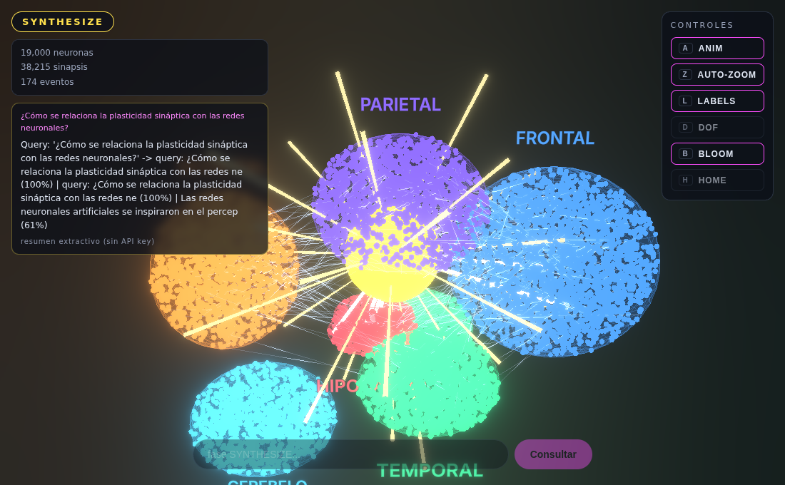
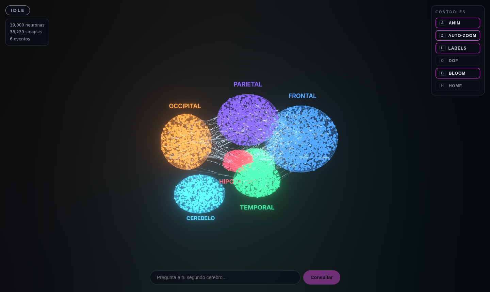

<div align="center">

# NEURAL BRAIN

**Un segundo cerebro visualizado como un cerebro humano de 19.000 neuronas en 3D, que se ilumina en vivo con tus consultas y con lo que hace Claude Code.**



`FastAPI` · `NetworkX` · `ChromaDB` · `sentence-transformers` · `GitPython` · `SSE` · `React 19` · `TypeScript` · `react-three-fiber` · `zustand`

</div>

---

## Qué es

| | |
|---|---|
| 🧠 **Cerebro anatómico** | 19.000 neuronas en 6 regiones (frontal, parietal, temporal, occipital, hipocampo, cerebelo) formadas por 8 elipsoides, con fibras largas tipo cuerpo calloso. Dos `InstancedMesh` (base + halo) → 2 draw calls. |
| 🔎 **Memoria semántica** | Cada texto ingerido, evento de Claude Code o pregunta se convierte en neurona con embedding en ChromaDB. |
| ⚡ **Consultas en 4 fases** | `INPUT` (neurona magenta arriba) → `SEARCH` (rayos magenta + "escaneando memoria...") → `CONNECT` (labels con % y conexiones blancas) → `SYNTHESIZE` (neurona amarilla gigante + explosión) → `IDLE`. Todo llega por **SSE**. |
| 🤖 **Claude** | Con `ANTHROPIC_API_KEY`, Claude redacta la respuesta de la fase SYNTHESIZE a partir de los recuerdos encontrados (se muestra en el HUD). Sin key, un resumen extractivo. |
| 🪝 **Claude Code en vivo** | Hooks `PostToolUse`: `Read` → temporal, `Grep/Glob` → parietal, `Edit/Write` → frontal, `Task` → hipocampo, `Bash` → cerebelo. Cada acción crea/ilumina una neurona al instante. |
| 🕰 **Versionado en Git** | El grafo se guarda en `graph.json` dentro de un repo Git local: commit automático cada 25 eventos o 60 s, historial y **restauración por hash**. |
| 🔭 **LOD** | Según la distancia de la cámara se dibujan 1k / 5k / 12k / 19k neuronas; el orden de render está estratificado, así que cualquier nivel muestra un cerebro completo y proporcionado. |



## Quick start

Requisitos: **Python 3.10+**, **Node 20.19+**.

```bash
git clone <este-repo> neural-brain && cd neural-brain
./scripts/setup.sh                   # venv + pip + npm (la 1ª vez descarga PyTorch)
nano backend/.env                    # opcional: ANTHROPIC_API_KEY=sk-ant-...
./scripts/run.sh                     # API :8000 + UI :5173
```

Abre **http://localhost:5173**. El primer arranque siembra 19.000 neuronas y hace el primer commit (unos segundos; la primera vez además descarga el modelo de embeddings, ~90 MB).

Para tener recuerdos con los que jugar:

```bash
make seed                            # 30 notas de ejemplo (IA, neurociencia, cyberpunk…) vía POST /ingest
```

y pregunta, por ejemplo: *«¿Cómo se relaciona la plasticidad sináptica con las redes neuronales?»*

<details>
<summary><b>Windows (PowerShell)</b></summary>

```powershell
.\scripts\setup.ps1
notepad backend\.env
.\scripts\run.ps1        # abre dos ventanas: API y UI
```
</details>

<details>
<summary><b>Manual</b></summary>

```bash
# backend (desde la raíz del repo: el backend es el paquete backend.app)
python3 -m venv backend/.venv && source backend/.venv/bin/activate
pip install -r backend/requirements.txt
cp backend/.env.example backend/.env
uvicorn backend.app.main:app --port 8000          # o: python -m backend.app.main

# frontend
cd frontend && npm install && cp .env.example .env && npm run dev
```
</details>

`make` · `setup` `run` `backend` `frontend` `test` `build` `seed` `hook-test` `clean` (borra el cerebro: vectores + repo Git del grafo).

## Conectar Claude Code (hooks)

1. Con el backend corriendo, prueba el hook a mano:
   ```bash
   make hook-test
   # = echo '{"tool_name":"Read","tool_input":{"file_path":"src/auth.py"},"cwd":"/tmp"}' | python3 backend/hooks/hook_handler.py
   ```
   Debe iluminarse una neurona en el lóbulo **temporal** con el label `Read: src/auth.py`.
2. Fusiona `backend/hooks/claude_settings.example.json` en `~/.claude/settings.json`, reemplazando `/ruta/a/neural-brain` por la ruta absoluta real.
3. Usa Claude Code con normalidad: cada `Read`, `Grep`, `Edit`, `Task` o `Bash` aparece en el cerebro en tiempo real.

El script usa sólo la stdlib, tiene timeout de 2 s y nunca falla de forma visible: si el backend está apagado, Claude Code sigue igual.

## Controles

| Control | Tecla | Qué hace |
|---|---|---|
| ANIM | `A` | Rotación automática |
| AUTO-ZOOM | `Z` | La cámara acompaña cada fase del query |
| LABELS | `L` | Labels con `%` en CONNECT |
| DOF | `D` | Profundidad de campo (desactivado por defecto: es caro) |
| BLOOM | `B` | Post-procesado bloom |
| HOME | `H` | Resetea la cámara |

Ratón: arrastrar = rotar · rueda = zoom (6–45, dispara el LOD) · click derecho = pan.

## API

| Método | Ruta | |
|---|---|---|
| GET | `/health` | estado + si Claude está activo |
| POST | `/ingest` | `{text, source?, region_hint?, label?}` → una neurona por frase (máx. 12) |
| POST | `/query` | `{text, top_k}` → hits inmediatos; las fases llegan por SSE (409 si ya hay una en curso) |
| GET | `/graph?detail=low\|medium\|high\|ultra` | nodos del orden estratificado (1k/5k/12k/19k) |
| GET | `/fibers` | fibras largas con posiciones de ambos extremos |
| GET | `/events/stream` | SSE: `phase`, `neuron_added`, `neuron_activated`, `edge_added`, `stats`, `graph_reloaded` |
| POST | `/hooks/event` | evento de Claude Code → neurona en su región |
| GET | `/regions`, `/stats` | info de regiones / contadores |
| POST | `/git/commit` · GET `/git/log` · POST `/git/restore` | snapshots del grafo |

Swagger en http://localhost:8000/docs. Detalle en [`docs/API.md`](docs/API.md).

## Configuración (`backend/.env`)

| Variable | Default | |
|---|---|---|
| `ANTHROPIC_API_KEY` | — | Opcional. Activa la respuesta de Claude en SYNTHESIZE. |
| `ANTHROPIC_MODEL` / `ANTHROPIC_EFFORT` | `claude-opus-5-5` / `low` | Modelo y esfuerzo de razonamiento. |
| `EMBEDDING_MODEL` | `all-MiniLM-L6-v2` | Para notas en español: `paraphrase-multilingual-MiniLM-L12-v2`. |
| `EMBEDDING_BACKEND` | `auto` | `hash` = embedder ligero sin descargas (tests/CI). |
| `CHROMA_DIR` / `GRAPH_REPO_DIR` | `data/chroma` / `data/graph_repo` | Relativas a `backend/`. |
| `AUTO_COMMIT_EVERY` / `AUTO_COMMIT_SECONDS` | `25` / `60` | Umbrales del auto-commit. |
| `PHASE_TIME_SCALE` | `1` | Estira la animación (2 = mitad de velocidad, útil en demos). |

Frontend (`frontend/.env`): `VITE_API_URL=http://localhost:8000`.

## Tests

```bash
make test        # 15 tests, sin red ni API key
```

Cubren: 19.000 neuronas sembradas, estratificación de cada nivel LOD, reciclado, posiciones dentro de los elipsoides, snapshot/restore, fan-out del SSE, las 5 fases en orden con el top-1 correcto, fallback a hipocampo, API completa, Git (commit/log/restore) y el `hook_handler`. CI ejecuta además `tsc` + build del frontend.

## Diferencias con la especificación

Implementado siguiendo [`docs/SPEC.md`](docs/SPEC.md), con estas correcciones (bugs del código del spec o cosas que no funcionaban en la práctica):

- **SSE a varias pestañas**: una única `asyncio.Queue` repartía los eventos entre clientes; ahora cada cliente tiene su cola.
- **Fibras**: se leían de `/graph?detail=low`, donde casi ninguna tiene ambos extremos → nuevo `GET /fibers`.
- **Halo**: el `GlowMaterial` no era transparente ni aditivo.
- **LOD**: podía dibujar instancias sin inicializar (amontonadas en el origen).
- **Neuronas recicladas/nuevas** no se redibujaban, y las recicladas no volvían al índice de su región.
- **Restore de Git**: el frontend no reconstruía las instancias; y el commit de apagado fallaba con Ctrl+C.
- **CameraRig**: el selector de `useThree` devolvía un objeto nuevo en cada render (bucle de re-render).
- **Texto 3D**: drei descargaba la fuente de un CDN y, si fallaba, dejaba el cerebro en negro → fuente Inter incluida y error boundary.
- `query_id` de `POST /query` coincide con el de los eventos; 409 con una consulta en curso; las preguntas anteriores se guardan como memoria pero no se citan como fuente de sí mismas.
- **Añadidos**: respuesta de Claude en SYNTHESIZE (el spec no usaba LLM), panel de respuesta en el HUD, embedder `hash` para tests, `PHASE_TIME_SCALE`, `make seed`.
- Versiones: el spec fija `vite 6`, `three 0.182`, `@react-spring/three 9`; se usan vite 8, three 0.186 y react-spring 10 (compatible con React 19), y `chromadb`/`fastapi` sin tope de versión mayor.

## Problemas comunes

- **La primera carga tarda**: el backend siembra 19k neuronas y descarga el modelo de embeddings antes de aceptar peticiones.
- **FPS bajos**: desactiva `BLOOM` (`B`) y `DOF` (`D`); aleja la cámara para bajar el LOD. Necesita WebGL2 con GPU.
- **El repo del grafo crece**: cada snapshot son ~8 MB de JSON (comprimidos por Git). `make clean` empieza de cero.
- **Empezar de cero**: `make clean` y reinicia el backend.

## Licencia

MIT
