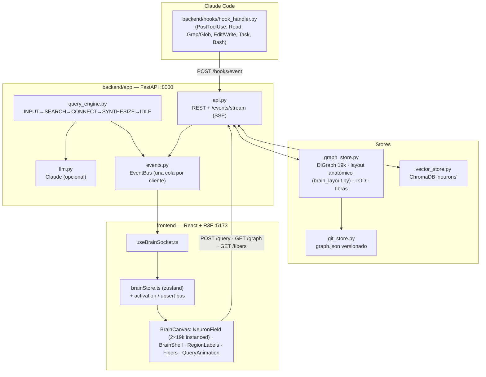

# Arquitectura

La especificación completa (código de referencia, timings, criterios de aceptación) está en
[`SPEC.md`](SPEC.md). Este documento resume cómo encaja todo y qué cambió respecto al spec.

## Backend (`backend/app`)

| Módulo | Qué hace |
|---|---|
| `models.py` | Contratos Pydantic (espejados en `frontend/src/types.ts`). |
| `../brain_layout.py` | v2.1: el cerebro como SDF (vista lateral; cerebelo fusionado bajo el occipital, polo frontal redondeado), `classify_regions` (espejada en `classifyRegion()` del frontend), muestreo uniforme en el volumen, generación de `brain_layout.json` y de la cáscara `brain_shell.json` (marching cubes). |
| `graph_store.py` | 19.000 neuronas sembradas desde `brain_layout.json` (6 regiones como zonas de un mismo volumen; hipocampo la menor); neuronas nuevas muestreadas dentro de su región; snapshots v1 migrados al cargar; 2 aristas locales por neurona; 240 fibras entre regiones; **orden de render estratificado proporcional**: en cualquier prefijo cada región aparece en su proporción (p. ej. el 25 % de cualquier prefijo es frontal), así cada nivel LOD es un cerebro completo. Cuando está lleno, `add_neuron` **recicla** la neurona semilla menos activada (conserva su posición en el orden), elegida con un min-heap perezoso en vez de reordenar 19k nodos en cada alta. |
| `vector_store.py` | ChromaDB con `sentence-transformers`; `EMBEDDING_BACKEND=hash` usa un embedder de hashing sin descargas. |
| `git_store.py` | `graph.json` en un repo Git local; commits con el CLI de `git` (sobrevive a Ctrl+C); auto-commit cada 25 eventos / 60 s; `restore(hash)` recarga y vuelve a commitear. |
| `events.py` | Bus de eventos con **una cola por suscriptor SSE** (el spec usaba una cola compartida que repartía los eventos entre pestañas). |
| `query_engine.py` | Máquina de fases con los timings del spec (×`PHASE_TIME_SCALE`). Claude empieza a escribir durante CONNECT y su respuesta viaja en `SYNTHESIZE.summary`; sin key, resumen extractivo. Las preguntas se guardan como neuronas del hipocampo, pero no se devuelven como fuentes. |
| `api.py` | Endpoints del spec + `GET /fibers`. |
| `main.py` | Carga el último `graph.json` si existe; si no, siembra y hace el commit inicial, en un hilo para no bloquear el event loop (uvicorn igualmente no acepta peticiones hasta que termina el arranque). Escucha en `127.0.0.1` por defecto: la API no tiene auth (`API_HOST` para cambiarlo). Rutas relativas a `backend/`. |

## Frontend (`frontend/src`)

| Pieza | Rendimiento |
|---|---|
| `NeuronField` | Dos `InstancedMesh` de 19k (base low-poly + halo aditivo con `GlowMaterial`). Matrices y colores se escriben una vez; las activaciones viven en un `Float32Array` fuera de React y sólo los índices sucios suben a la GPU. |
| `brainStore` | zustand con selectores finos; `onActivation` y `onNeuronUpsert` son buses fuera de React (60 fps sin re-render). `graphVersion` fuerza a reconstruir instancias tras un restore. |
| `useLOD` | `mesh.count` según la distancia de la cámara al centro del cerebro, así el pan no cambia el nivel (≤12 → 19k, ≤18 → 12k, ≤26 → 5k, resto 1k), suavizado y nunca mayor que las instancias cargadas. |
| `Fibers` | Un único `LineSegments` con shader de pulso viajero. |
| `QueryAnimation` | Una escena por fase; textos con fuente Inter local en un error boundary propio. |
| `FloatingLabels` | Único renderer de textos flotantes: los 6 nombres de región y los `%` de CONNECT se de-colisionan juntos en espacio de pantalla (`labelLayout2D.ts`), al cambiar de fase y cada 250 ms mientras la cámara se mueve. |
| `useBrainSocket` | SSE; si la conexión se cayó (backend reiniciado), al reabrirse recarga `/graph`. |
