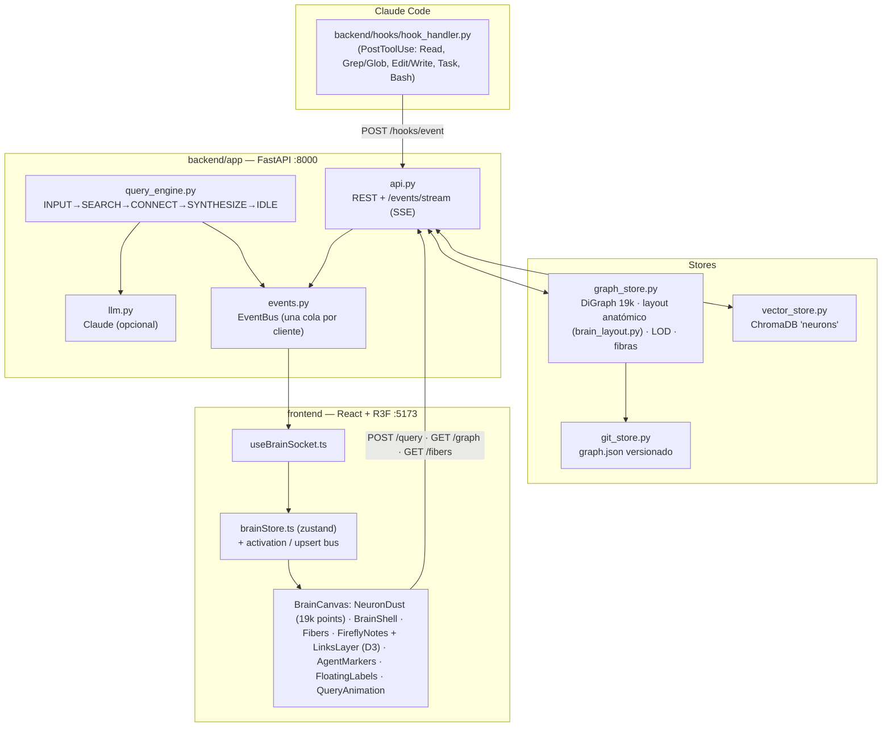

# Arquitectura

La especificación completa (código de referencia, timings, criterios de aceptación) está en
[`SPEC.md`](SPEC.md). Este documento resume cómo encaja todo y qué cambió respecto al spec.

## Backend (`backend/app`)

| Módulo | Qué hace |
|---|---|
| `models.py` | Contratos Pydantic (espejados en `frontend/src/types.ts`). |
| `../brain_layout.py` | v2.1: el cerebro como SDF (vista lateral; cerebelo fusionado bajo el occipital, polo frontal redondeado), `classify_regions` (espejada en `classifyRegion()` del frontend), muestreo uniforme en el volumen, generación de `brain_layout.json` y de la cáscara `brain_shell.json` (marching cubes). |
| `graph_store.py` | 19.000 neuronas sembradas desde `brain_layout.json` (6 regiones como zonas de un mismo volumen; hipocampo la menor); neuronas nuevas muestreadas dentro de su región; snapshots v1 migrados al cargar; 2 aristas locales por neurona; 240 fibras entre regiones; **orden de render estratificado proporcional**: en cualquier prefijo cada región aparece en su proporción (p. ej. el 25 % de cualquier prefijo es frontal), así cada nivel LOD es un cerebro completo. Cuando está lleno, `add_neuron` **recicla** la neurona semilla menos activada (conserva su posición en el orden), elegida con un min-heap perezoso en vez de reordenar 19k nodos en cada alta. |
| `vector_store.py` | ChromaDB con `sentence-transformers`; `EMBEDDING_BACKEND=hash` usa un embedder de hashing sin descargas. |
| `git_store.py` | `graph.json` en un repo Git local; commits con el CLI de `git` (sobrevive a Ctrl+C); auto-commit cada 25 eventos / 60 s; `restore(hash)` recarga y vuelve a commitear. |
| `events.py` | Bus de eventos con **una cola por suscriptor SSE** (el spec usaba una cola compartida que repartía los eventos entre pestañas). |
| `query_engine.py` | Máquina de fases con los timings del spec (×`PHASE_TIME_SCALE`). Claude empieza a escribir durante CONNECT y su respuesta viaja en `SYNTHESIZE.summary`; sin key, resumen extractivo. Las preguntas se guardan como neuronas del hipocampo, pero no se devuelven como fuentes. |
| `notes.py` | Vista de **notas**: una por memoria ingerida (sus frases comparten `note_id`) o pregunta. Grupos con color y ancla dentro de una región; conexiones tipadas (`wiki`, `enlace`, `indice`, `responde`, `mencion`, `carpeta`, `cadena`, `comparte`, `sugerida`, `parecida`) y problemas (enlace roto, huérfana, duplicado). `resolve_note` asocia un archivo o patrón de una acción con su nota. |
| `activity.py` | Actividad en vivo de los agentes (Claude Code, Cursor, Codex…): sesiones (trabajando / pensando / esperando / en reposo), subagentes numerados (un `Task` lanzado se une a su `SubagentStart`), acción de cada evento, archivos editados con +/− en la última media hora, eventos por segundo y uso por nota. |
| `demo.py` | Sesión simulada (botón **Probar**): Claude Code y Cursor trabajando a la vez, por el mismo camino que los hooks. |
| `../hooks/` | Adaptadores de agentes, solo stdlib y nunca bloquean: `hook_handler.py` (Claude Code), `cursor_hook.py` (hooks de Cursor), `agent_event.py` (CLI genérico: Codex `notify`, Gemini CLI, Aider, scripts). Todos envían `client` para que cada sesión muestre su agente. |
| `api.py` | Endpoints del spec + `GET /fibers`, `GET /notes` (cacheada hasta que cambian las notas), `GET /activity`, `POST /activity/demo`. |
| `main.py` | Carga el último `graph.json` si existe; si no, siembra y hace el commit inicial, en un hilo para no bloquear el event loop (uvicorn igualmente no acepta peticiones hasta que termina el arranque). Escucha en `127.0.0.1` por defecto: la API no tiene auth (`API_HOST` para cambiarlo). Rutas relativas a `backend/`. |

## Frontend (`frontend/src`)

| Pieza | Rendimiento |
|---|---|
| `NeuronDust` | Las 19k neuronas como un único `THREE.Points` (polvo aditivo con titileo). Casi invisibles en reposo; cada activación enciende la neurona (se apaga en ~15 s) y, con un hash espacial, programa una **onda** que dispara a las vecinas según la distancia. `emitSpark(posición)` hace lo mismo alrededor de una nota o de un hit. |
| `arousal.ts` | Nivel global de "despierto" (0–1): lo suben las acciones de los agentes y las preguntas, decae solo; todas las capas (polvo, notas, conexiones, corteza, fibras, etiquetas) lo usan como brillo base. `noteAwake` hace lo mismo por nota. |
| `noteLayout.ts` | `d3-force-3d`: enlaces (fuerza según el tipo), repulsión, colisión, atracción al ancla del grupo y una fuerza que devuelve cada nota al interior del cerebro por el gradiente del SDF (`sdfBrain`, espejo de Python). Conserva la posición de las notas que ya existían; `Reacomodar` usa otra semilla. |
| `FireflyNotes` / `LinksLayer` | Un `Points` donde cada nota es una **luciérnaga** (núcleo blanco + halo del color de su grupo) que palpita a su propio ritmo irregular (fase determinista por id, calculada en el vertex shader; se congela sin *Animaciones*; el tipo se ve en el tamaño) y un `LineSegments` con curvas de Bézier dobladas hacia el centro (efecto de haz), trazo continuo/discontinuo/punteado y pulso viajero. `NotesAnimator` interpola las posiciones hacia el layout (`livePositions`, fuera de React). |
| `AgentMarkers` | Un marcador por agente activo que viaja a la nota que tocó y un arco desde el punto de su sesión. Sus chips HTML (pequeños y tenues; los agentes terminados se ocultan) se separan en espacio de pantalla con `pillLayout.ts` (`PillDecollider`, cada 150 ms). |
| `brainStore` | zustand con selectores finos; `onActivation` y `onNeuronUpsert` son buses fuera de React (60 fps sin re-render). `graphVersion` fuerza a reconstruir instancias tras un restore. |
| `Fibers` | Un único `LineSegments` con shader de pulso viajero. |
| `QueryAnimation` | Una escena por fase; textos con fuente Inter local en un error boundary propio. |
| `FloatingLabels` | Único renderer de textos flotantes: nombres de grupo (diminutos y tenues, solo con la cámara cerca), títulos (tamaño casi constante en pantalla) de las notas más conectadas (o de la búsqueda) y los `%` de una consulta, de-colisionados juntos en espacio de pantalla (`labelLayout2D.ts`) cada 300 ms. |
| `useBrainSocket` | SSE: `notes_changed` → `/notes`, `activity` → panel + pulso de la nota + `/activity`; si la conexión se cayó, al reabrirse recarga todo. Los hits de una consulta se redirigen a la posición D3 de su nota. |
| `ui/` | Estilo "instrumento científico": IBM Plex Mono/Sans locales (`@fontsource`), filetes finos, esquinas rectas y un solo acento ámbar. Barra superior de lecturas (neuronas, notas, conexiones, problemas, ev/s, señal, hora), barra lateral con filtros numerados, Grafo/Lista, Grupos/Uso, panel *Ahora* como registro con hora, osciloscopio de actividad, reglas y marcas del visor, lectura de cámara (`CameraReadout.tsx`, fuera de React) y ficha de nota. |
