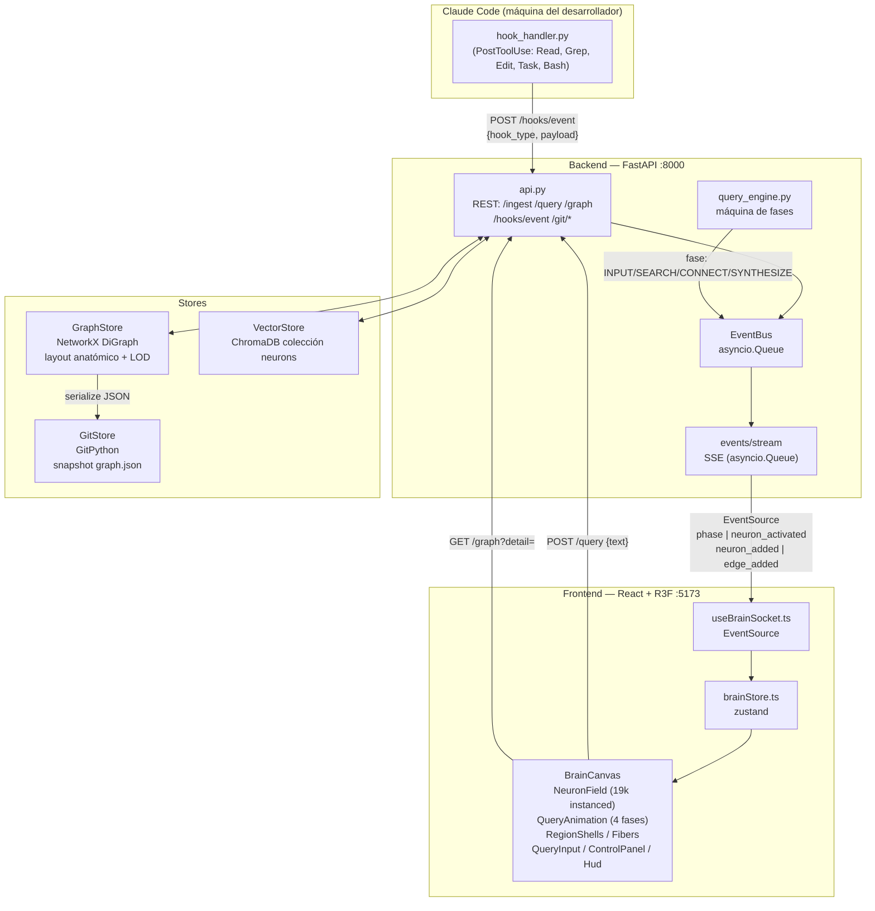

# NEURAL BRAIN — Prompt técnico completo de implementación

> **INSTRUCCIÓN PARA CLAUDE CODE:** Actúa como ingeniero senior full-stack especializado en
> visualización 3D y sistemas de IA. Implementa el sistema descrito en este documento de forma
> completa y funcional. Crea cada archivo exactamente en la ruta indicada, con el código completo
> (sin omitir partes, sin comentarios del tipo "resto igual" o "// ..."). Sigue el orden de
> implementación de la sección 16. Al terminar cada fase, verifica que el código no tenga errores
> de sintaxis. No inventes librerías: usa únicamente las listadas en `requirements.txt` y
> `package.json`. Mantén coherencia total entre backend y frontend (mismos endpoints, mismos
> campos, mismos nombres de eventos SSE).

---

## 1. Resumen ejecutivo

**Neural Brain** es un sistema de "segundo cerebro": captura conocimiento (texto ingerido,
acciones de Claude Code vía hooks, queries del usuario), lo almacena en un grafo de
conocimiento + base de datos vectorial, lo versiona con Git, y lo visualiza como un cerebro
humano en 3D renderizado en tiempo real en el navegador.

### Objetivos medibles

| Objetivo | Meta |
|---|---|
| Neuronas renderizadas | 19,000 instancias 3D a 60 fps |
| Regiones anatómicas | 6 (frontal, parietal, temporal, occipital, hipocampo, cerebelo) |
| Latencia de actualización en vivo | SSE < 100 ms desde el evento hasta el frame |
| Fases de animación en queries | 4 fases visibles y diferenciadas |
| Persistencia | Cada cambio versionado en Git, restaurable por hash |
| Integración Claude Code | 5 hooks que crean/activan neuronas en tiempo real |

### Cómo usar este documento con Claude Code

1. Crea la estructura de directorios de la sección 3.
2. Implementa los archivos en el orden de la sección 16 (modelos → stores → API → hooks →
   frontend base → neuronas → animaciones → controles).
3. Copia cada bloque de código a su archivo correspondiente. Los bloques están completos.
4. Instala dependencias con la sección 15 y ejecuta backend + frontend.
5. Valida contra la checklist de la sección 17.

### Estado actual (punto de partida)

Ya existe un proyecto básico funcional con:

- **Backend:** FastAPI + Python, ChromaDB (vectores), NetworkX (grafo), sentence-transformers
  (embeddings).
- **Frontend:** React + Three.js (React Three Fiber), visualización 3D básica.
- **Funcionalidad:** ingesta de texto, búsqueda semántica, queries con LLM.

Este prompt escala ese proyecto al sistema completo descrito aquí. Si algún archivo ya existe
(p. ej. un `main.py` básico), **reemplázalo** con la versión de este documento.

---

## 2. Arquitectura del sistema

### 2.1 Diagrama general (Mermaid)



### 2.2 Flujo de datos por dirección

**Dirección 1 — Claude Code → Cerebro (ingesta en vivo):**

1. El usuario ejecuta una herramienta en Claude Code (p. ej. `Read` sobre un archivo).
2. El hook `PostToolUse` dispara `hook_handler.py`, que recibe por stdin un JSON con
   `tool_name`, `tool_input` y `cwd`.
3. `hook_handler.py` mapea la herramienta a una región cerebral (`Read` → temporal,
   `Edit` → frontal, `Grep/Glob` → parietal, `Task` → hipocampo, `Bash` → cerebelo) y hace
   `POST /hooks/event` al backend.
4. El backend crea (o recicla) una neurona en esa región con label descriptivo
   (`"Read: src/auth.py"`), la conecta con 2 vecinas, genera su embedding y lo guarda en
   ChromaDB.
5. El backend publica `neuron_added` + `neuron_activated` en el `EventBus`.
6. El SSE lo empuja al frontend en <100 ms; la neurona aparece/ilumina en el cerebro 3D.

**Dirección 2 — Query del usuario (las 4 fases):**

1. El usuario escribe en `QueryInput` → `POST /query {text, top_k}`.
2. `query_engine.run_query_phases` emite por SSE la secuencia de fases con pausas
   temporizadas:
   - `INPUT`: payload con posición `[0, 9.5, 0]` → el frontend muestra la neurona
     magenta flotando arriba.
   - `SEARCH`: el backend corre la búsqueda semántica en ChromaDB y emite los primeros
     4 candidatos → rayos magenta + texto "escaneando memoria...".
   - `CONNECT`: emite los hits finales con scores → neuronas iluminadas, labels con
     porcentajes, conexiones blancas gruesas.
   - `SYNTHESIZE`: emite el resumen → neurona amarilla gigante central + explosión de
     rayos; luego vuelve a `IDLE`.
3. Cada fase también activa neuronas reales en el `GraphStore` (quedan como memoria).

**Dirección 3 — Persistencia:**

1. Cada evento mutante incrementa un contador en `GraphStore`.
2. Cada 25 eventos o 60 segundos (lo que ocurra primero), `GitStore` serializa el grafo a
   `graph.json` y hace commit con mensaje descriptivo.
3. `POST /git/restore {commit_hash}` revierte `graph.json` a un commit anterior y recarga
   el grafo en memoria; el frontend recibe `graph_reloaded` y refresca.

**Dirección 4 — Carga inicial y LOD:**

1. Al montar, el frontend pide `GET /graph?detail=ultra` (19k nodos en orden estratificado).
2. `NeuronField` crea un `InstancedMesh` de 19,000 esferas de baja poly.
3. En cada frame, según la distancia de la cámara, ajusta `mesh.count`
   (1000 / 5000 / 12000 / 19000). Como el orden es estratificado por región, los primeros
   N siempre representan todo el cerebro.

---

## 3. Estructura de directorios

```text
neural-brain/
├── backend/
│   ├── app/
│   │   ├── __init__.py
│   │   ├── main.py            # FastAPI app, CORS, lifespan (seed + autocommit loop)
│   │   ├── models.py          # Pydantic: Region, Phase, EdgeType, NeuronNode,
│   │   │                      #   SynapseEdge, BrainEvent, schemas de request/response
│   │   ├── graph_store.py     # GraphStore: DiGraph + layout anatómico + LOD + fibras
│   │   ├── vector_store.py    # VectorStore: wrapper ChromaDB + sentence-transformers
│   │   ├── git_store.py       # GitStore: snapshots con GitPython + restore
│   │   ├── events.py          # EventBus con asyncio.Queue
│   │   ├── query_engine.py    # Máquina de fases INPUT→SEARCH→CONNECT→SYNTHESIZE
│   │   └── api.py             # Router con todos los endpoints REST + SSE
│   ├── hooks/
│   │   ├── hook_handler.py            # Lee stdin JSON de Claude Code → POST /hooks/event
│   │   └── claude_settings.example.json  # Ejemplo para ~/.claude/settings.json
│   ├── data/                  # (generado) chroma/, graph_repo/
│   ├── requirements.txt
│   └── .env.example
└── frontend/
    ├── src/
    │   ├── main.tsx
    │   ├── App.tsx
    │   ├── index.css
    │   ├── types.ts                 # Tipos TS espejo de models.py
    │   ├── config.ts                # API_URL y constantes
    │   ├── store/
    │   │   └── brainStore.ts        # zustand: phase, neurons, rays, labels, settings
    │   ├── hooks/
    │   │   ├── useBrainSocket.ts    # EventSource SSE → store + carga inicial del grafo
    │   │   └── useLOD.ts            # Cálculo de nivel LOD según distancia de cámara
    │   ├── shaders/
    │   │   └── glowMaterial.ts      # shaderMaterial (drei): halo fresnel pulsante
    │   └── components/
    │       ├── BrainCanvas.tsx      # Canvas R3F, OrbitControls, Bloom, niebla
    │       ├── NeuronField.tsx      # InstancedMesh 19k + glow + LOD + activaciones
    │       ├── RegionShells.tsx      # Elipsoides semitransparentes + labels región
    │       ├── Fibers.tsx           # Fibras inter-regionales con pulso (shader)
    │       ├── QueryAnimation.tsx   # Máquina de fases 3D (INPUT/SEARCH/CONNECT/SYNTHESIZE)
    │       ├── QueryInput.tsx       # Input inferior → POST /query
    │       ├── ControlPanel.tsx     # Toggles ANIM/AUTO-ZOOM/LABELS/DOF + HOME + atajos
    │       └── Hud.tsx              # Overlay: fase actual, contadores
    ├── package.json
    ├── vite.config.ts
    ├── tsconfig.json
    └── .env.example
```

### Descripción de cada archivo

**Backend:**

| Archivo | Responsabilidad |
|---|---|
| `app/main.py` | Crea la app FastAPI, configura CORS, en `lifespan` instancia los stores, siembra el cerebro inicial (19k neuronas) y lanza el loop de auto-commit de Git |
| `app/models.py` | Contratos de datos: enums `Region`, `Phase`, `EdgeType`; modelos `NeuronNode`, `SynapseEdge`, `BrainEvent`; schemas de cada endpoint |
| `app/graph_store.py` | Grafo en memoria (NetworkX `DiGraph`): layout anatómico por elipsoides, presupuesto de 19k neuronas, LOD estratificado, fibras corpus callosum, activación con decaimiento |
| `app/vector_store.py` | ChromaDB colección `neurons`: alta con embeddings, búsqueda semántica que devuelve ids + scores |
| `app/git_store.py` | Repo Git local: `snapshot()` serializa el grafo y commitea; `restore(hash)` revierte; `log()` lista historial |
| `app/events.py` | `EventBus` con `asyncio.Queue`: `publish()` / generador async para el SSE |
| `app/query_engine.py` | `run_query_phases()`: corutina que emite las 4 fases por SSE con timings y activa neuronas reales |
| `app/api.py` | Endpoints: `/ingest`, `/query`, `/graph`, `/events/stream`, `/hooks/event`, `/regions`, `/git/commit`, `/git/restore`, `/health` |
| `hooks/hook_handler.py` | Script standalone: parsea el JSON de Claude Code desde stdin, mapea tool→región, POST al backend |
| `hooks/claude_settings.example.json` | Configuración de hooks lista para copiar a `~/.claude/settings.json` |

**Frontend:**

| Archivo | Responsabilidad |
|---|---|
| `store/brainStore.ts` | Estado global zustand: fase, mapa de neuronas (19k), orden estratificado, rayos, labels 3D, settings, stats; bus de activaciones sin re-render |
| `hooks/useBrainSocket.ts` | Conecta `EventSource` a `/events/stream`, traduce eventos SSE a acciones del store, carga inicial `GET /graph?detail=ultra` |
| `hooks/useLOD.ts` | Función pura `getLODLevel(distance)` + hook con distancia suavizada de cámara |
| `shaders/glowMaterial.ts` | `shaderMaterial` de drei: halo aditivo con fresnel y pulso para neuronas activadas |
| `components/BrainCanvas.tsx` | `<Canvas>`, `OrbitControls` (autoRotate), `EffectComposer`+`Bloom`+`DepthOfField` opcional, niebla, `<Suspense>` |
| `components/NeuronField.tsx` | Dos `InstancedMesh` (base 19k + glow): matrices y colores por instancia, activación con decaimiento por frame, `mesh.count` por LOD |
| `components/RegionShells.tsx` | 8 elipsoides semitransparentes (uno por lóbulo) con labels de región (drei `Text`) |
| `components/Fibers.tsx` | `LineSegments` con `ShaderMaterial` custom: 240 fibras largas con pulso viajero |
| `components/QueryAnimation.tsx` | Renderiza la fase activa: neurona magenta (spring), rayos de escaneo, labels con %, conexiones blancas gruesas (drei `Line`), neurona amarilla gigante + explosión |
| `components/QueryInput.tsx` | Barra inferior: `POST /query`, Enter para enviar, deshabilitada durante fases activas |
| `components/ControlPanel.tsx` | Panel superior derecho: toggles ANIM, AUTO-ZOOM, LABELS, DOF, botón HOME; atajos de teclado |
| `components/Hud.tsx` | Overlay superior izquierdo: badge de fase, contadores de neuronas/eventos |

---

## 4. Modelos de datos — `backend/app/models.py`

Contratos compartidos por todo el backend. El frontend los replica en `src/types.ts`
(sección 10). No cambies nombres de campos sin actualizar ambos lados.

```python
"""Shared data contracts for Neural Brain.

These models are the single source of truth for the shape of neurons,
synapses and events. The frontend mirrors them in src/types.ts — keep both
in sync when adding fields.
"""
from __future__ import annotations

from datetime import datetime, timezone
from enum import Enum
from typing import Any, Dict, List, Literal, Optional, Tuple

from pydantic import BaseModel, Field


# ---------------------------------------------------------------------------
# Enums
# ---------------------------------------------------------------------------

class Region(str, Enum):
    """The six anatomical brain regions used for layout and hook mapping."""
    FRONTAL = "frontal"
    PARIETAL = "parietal"
    TEMPORAL = "temporal"
    OCCIPITAL = "occipital"
    HIPPOCAMPUS = "hippocampus"
    CEREBELLUM = "cerebellum"


class Phase(str, Enum):
    """The four query animation phases plus the resting state."""
    IDLE = "IDLE"
    INPUT = "INPUT"
    SEARCH = "SEARCH"
    CONNECT = "CONNECT"
    SYNTHESIZE = "SYNTHESIZE"


class EdgeType(str, Enum):
    """Kind of synapse/connection between neurons."""
    LOCAL = "local"    # short-range, same region
    FIBER = "fiber"    # long-range inter-regional (corpus callosum style)
    QUERY_RAY = "query_ray"  # transient ray cast during SEARCH/CONNECT phases


# ---------------------------------------------------------------------------
# Core graph models
# ---------------------------------------------------------------------------

class NeuronNode(BaseModel):
    """A single neuron in the 3D brain."""
    id: str = Field(..., description="Unique neuron id, e.g. 'n_000123' or 'hook_9f3a'")
    label: str = Field(default="", description="Human readable label shown on hover/labels")
    region: Region = Field(..., description="Anatomical region this neuron lives in")
    position: Tuple[float, float, float] = Field(
        ..., description="Anatomical 3D position (x: front-back, y: up-down, z: left-right)"
    )
    size: float = Field(default=1.0, ge=0.1, le=5.0, description="Visual size multiplier")
    color: str = Field(default="#4da3ff", description="Base hex color (usually the region color)")
    color_state: Literal["base", "active", "magenta", "yellow"] = Field(
        default="base", description="Transient visual override used by the animation phases"
    )
    activation: float = Field(default=0.0, ge=0.0, le=1.0, description="Current activation 0..1")
    embedding_ref: Optional[str] = Field(
        default=None, description="ChromaDB document id holding this neuron's embedding"
    )
    source: Literal["seed", "ingest", "hook", "query"] = Field(
        default="seed", description="How this neuron was created"
    )
    created_at: datetime = Field(default_factory=lambda: datetime.now(timezone.utc))
    last_activated_at: Optional[datetime] = Field(default=None)
    metadata: Dict[str, Any] = Field(default_factory=dict)


class SynapseEdge(BaseModel):
    """A directed connection between two neurons."""
    source: str
    target: str
    weight: float = Field(default=0.5, ge=0.0, le=1.0)
    type: EdgeType = Field(default=EdgeType.LOCAL)
    created_at: datetime = Field(default_factory=lambda: datetime.now(timezone.utc))


class BrainEvent(BaseModel):
    """Anything that happened to the brain, also the SSE payload shape."""
    event_type: str = Field(
        ..., description="phase | neuron_added | neuron_activated | edge_added | stats | graph_reloaded"
    )
    payload: Dict[str, Any] = Field(default_factory=dict)
    timestamp: datetime = Field(default_factory=lambda: datetime.now(timezone.utc))


# ---------------------------------------------------------------------------
# REST request / response schemas
# ---------------------------------------------------------------------------

class IngestRequest(BaseModel):
    text: str = Field(..., min_length=1, max_length=20000)
    source: str = Field(default="manual", description="manual | file | web | note")
    region_hint: Optional[Region] = Field(default=None)
    label: Optional[str] = Field(default=None)


class IngestResponse(BaseModel):
    neuron_ids: List[str]
    count: int


class QueryRequest(BaseModel):
    text: str = Field(..., min_length=1, max_length=2000)
    top_k: int = Field(default=8, ge=1, le=20)


class QueryHit(BaseModel):
    id: str
    label: str
    region: Region
    score: float
    position: Tuple[float, float, float]


class QueryResponse(BaseModel):
    query_id: str
    hits: List[QueryHit]


class GraphNodeDTO(BaseModel):
    """Lightweight node for GET /graph (no datetimes, no metadata)."""
    id: str
    label: str
    region: Region
    x: float
    y: float
    z: float
    size: float
    color: str


class GraphEdgeDTO(BaseModel):
    source: str
    target: str
    weight: float
    type: EdgeType


class GraphResponse(BaseModel):
    nodes: List[GraphNodeDTO]
    edges: List[GraphEdgeDTO]
    total_neurons: int
    detail: str


class HookEventRequest(BaseModel):
    hook_type: str = Field(..., description="file_read | file_search | file_edit | agent_launch | command")
    tool_name: str = Field(default="")
    summary: str = Field(default="", description="Short human summary, e.g. 'Read: src/auth.py'")
    cwd: str = Field(default="")
    extra: Dict[str, Any] = Field(default_factory=dict)


class HookEventResponse(BaseModel):
    ok: bool
    neuron_id: str
    region: Region
    recycled: bool = False


class RegionInfo(BaseModel):
    region: Region
    neuron_count: int
    color: str
    center: Tuple[float, float, float]
    radii: Tuple[float, float, float]


class GitCommitRequest(BaseModel):
    message: Optional[str] = None


class GitCommitResponse(BaseModel):
    commit_hash: str
    message: str


class GitRestoreRequest(BaseModel):
    commit_hash: str = Field(..., min_length=7)


class GitRestoreResponse(BaseModel):
    ok: bool
    commit_hash: str


class GitLogEntry(BaseModel):
    hash: str
    message: str
    committed_at: str


class StatsResponse(BaseModel):
    total_neurons: int
    total_edges: int
    total_events: int
    phase: Phase
```

---

## 5. GraphStore — `backend/app/graph_store.py`

El corazón del sistema: `DiGraph` de NetworkX con layout anatómico, LOD estratificado y
fibras inter-regionales. Todo el acceso está protegido por un `threading.Lock` porque los
hooks y el loop de auto-commit escriben desde hilos distintos al event loop.

```python
"""Anatomical 3D graph store for Neural Brain.

- Seeds MAX_NEURONS (19,000) neurons distributed inside 8 ellipsoids that form
  the 6 brain regions (lateral-view brain shape).
- Stratified render order: region proportions are preserved in every prefix of
  the order, so LOD levels (1k/5k/12k/19k) always show a representative brain.
- Long-range FIBER edges model the corpus callosum (inter-regional bundles).
- Thread-safe: hooks and the git auto-commit loop write from other threads.
"""
from __future__ import annotations

import json
import math
import random
import threading
import uuid
from datetime import datetime, timezone
from pathlib import Path
from typing import Dict, List, Optional, Tuple

import networkx as nx

from .models import EdgeType, NeuronNode, Phase, Region, SynapseEdge

MAX_NEURONS = 19000

LOD_LEVELS: Dict[str, int] = {
    "low": 1000,
    "medium": 5000,
    "high": 12000,
    "ultra": 19000,
}

# Ellipsoids per region. Axes: x = front(+) / back(-), y = up(+) / down(-),
# z = right(+) / left(-). Units are arbitrary scene units; the brain spans
# roughly x in [-6, 7], y in [-4.6, 4.4].
REGION_ELLIPSOIDS: Dict[Region, List[Dict[str, Tuple[float, float, float]]]] = {
    Region.FRONTAL: [
        {"center": (4.0, 1.0, 0.0), "radii": (2.6, 2.4, 2.2)},
    ],
    Region.PARIETAL: [
        {"center": (0.2, 2.4, 0.0), "radii": (2.2, 1.8, 2.0)},
    ],
    Region.TEMPORAL: [
        {"center": (0.8, -1.4, 1.9), "radii": (1.6, 1.2, 1.0)},
        {"center": (0.8, -1.4, -1.9), "radii": (1.6, 1.2, 1.0)},
    ],
    Region.OCCIPITAL: [
        {"center": (-4.2, 0.8, 0.0), "radii": (1.8, 2.0, 1.8)},
    ],
    Region.HIPPOCAMPUS: [
        {"center": (-0.5, -0.6, 0.7), "radii": (1.1, 0.6, 0.5)},
        {"center": (-0.5, -0.6, -0.7), "radii": (1.1, 0.6, 0.5)},
    ],
    Region.CEREBELLUM: [
        {"center": (-3.4, -3.2, 0.0), "radii": (1.9, 1.4, 1.6)},
    ],
}

# Neuron budget per region. Must sum to MAX_NEURONS.
REGION_BUDGET: Dict[Region, int] = {
    Region.FRONTAL: 5200,
    Region.PARIETAL: 3600,
    Region.TEMPORAL: 4200,
    Region.OCCIPITAL: 2400,
    Region.HIPPOCAMPUS: 1600,
    Region.CEREBELLUM: 2000,
}

REGION_COLORS: Dict[Region, str] = {
    Region.FRONTAL: "#4da3ff",
    Region.PARIETAL: "#8a63ff",
    Region.TEMPORAL: "#3ddc97",
    Region.OCCIPITAL: "#ff9f43",
    Region.HIPPOCAMPUS: "#ff4d6d",
    Region.CEREBELLUM: "#4dd2ff",
}

# (region_a, region_b, fiber_count): long-range bundles (corpus callosum style).
FIBER_PAIRS: List[Tuple[Region, Region, int]] = [
    (Region.FRONTAL, Region.PARIETAL, 70),
    (Region.FRONTAL, Region.TEMPORAL, 50),
    (Region.PARIETAL, Region.OCCIPITAL, 50),
    (Region.HIPPOCAMPUS, Region.FRONTAL, 40),
    (Region.TEMPORAL, Region.OCCIPITAL, 30),
]


def _utcnow() -> datetime:
    return datetime.now(timezone.utc)


class GraphStore:
    def __init__(self, seed: int = 42) -> None:
        self.graph: nx.DiGraph = nx.DiGraph()
        self.lock = threading.Lock()
        self.rng = random.Random(seed)
        self.event_count: int = 0
        self.phase: Phase = Phase.IDLE
        # Stratified render order: list of neuron ids, region-interleaved.
        self.render_order: List[str] = []
        # Per-region id lists for fast sampling.
        self.region_index: Dict[Region, List[str]] = {r: [] for r in Region}

    # ------------------------------------------------------------------
    # Layout helpers
    # ------------------------------------------------------------------
    def _sample_in_ellipsoid(
        self, center: Tuple[float, float, float], radii: Tuple[float, float, float]
    ) -> Tuple[float, float, float]:
        """Uniform random point inside an ellipsoid (gaussian direction + cbrt radius)."""
        while True:
            v = [self.rng.gauss(0.0, 1.0) for _ in range(3)]
            norm = math.sqrt(sum(c * c for c in v)) or 1.0
            direction = [c / norm for c in v]
            r = self.rng.random() ** (1.0 / 3.0)
            point = tuple(center[i] + direction[i] * r * radii[i] for i in range(3))
            return point

    def _sample_position(self, region: Region) -> Tuple[float, float, float]:
        ellipsoids = REGION_ELLIPSOIDS[region]
        chosen = ellipsoids[self.rng.randrange(len(ellipsoids))]
        return self._sample_in_ellipsoid(chosen["center"], chosen["radii"])

    # ------------------------------------------------------------------
    # Seeding
    # ------------------------------------------------------------------
    def seed_brain(self) -> int:
        """Create MAX_NEURONS neurons with local edges + inter-regional fibers."""
        with self.lock:
            if self.graph.number_of_nodes() > 0:
                return self.graph.number_of_nodes()
            counter = 0
            for region, budget in REGION_BUDGET.items():
                for _ in range(budget):
                    counter += 1
                    neuron_id = f"n_{counter:05d}"
                    pos = self._sample_position(region)
                    node = NeuronNode(
                        id=neuron_id,
                        label=f"{region.value} neuron {counter}",
                        region=region,
                        position=pos,
                        size=round(self.rng.uniform(0.7, 1.3), 2),
                        color=REGION_COLORS[region],
                        source="seed",
                    )
                    self.graph.add_node(neuron_id, **node.model_dump())
                    self.region_index[region].append(neuron_id)
            self._build_local_edges()
            self._build_fibers()
            self._build_render_order()
            return self.graph.number_of_nodes()

    def _build_local_edges(self) -> None:
        """Connect every neuron to 2 random same-region neighbors (local circuitry)."""
        for region, ids in self.region_index.items():
            n = len(ids)
            if n < 3:
                continue
            for neuron_id in ids:
                targets = self.rng.sample([i for i in ids if i != neuron_id], 2)
                for target in targets:
                    if not self.graph.has_edge(neuron_id, target):
                        edge = SynapseEdge(
                            source=neuron_id,
                            target=target,
                            weight=round(self.rng.uniform(0.2, 0.7), 2),
                            type=EdgeType.LOCAL,
                        )
                        self.graph.add_edge(neuron_id, target, **edge.model_dump())

    def _build_fibers(self) -> None:
        """Long-range inter-regional fibers (corpus callosum style bundles)."""
        for region_a, region_b, count in FIBER_PAIRS:
            ids_a = self.region_index[region_a]
            ids_b = self.region_index[region_b]
            if not ids_a or not ids_b:
                continue
            for _ in range(count):
                a = self.rng.choice(ids_a)
                b = self.rng.choice(ids_b)
                edge = SynapseEdge(
                    source=a, target=b,
                    weight=round(self.rng.uniform(0.7, 1.0), 2),
                    type=EdgeType.FIBER,
                )
                self.graph.add_edge(a, b, **edge.model_dump())

    def _build_render_order(self) -> None:
        """Interleave per-region shuffled ids so every prefix is stratified."""
        shuffled = {r: ids[:] for r, ids in self.region_index.items()}
        for ids in shuffled.values():
            self.rng.shuffle(ids)
        order: List[str] = []
        remaining = True
        while remaining:
            remaining = False
            for region in Region:
                bucket = shuffled[region]
                if bucket:
                    order.append(bucket.pop())
                    remaining = True
        self.render_order = order

    # ------------------------------------------------------------------
    # Mutation API
    # ------------------------------------------------------------------
    def add_neuron(
        self,
        label: str,
        region: Region,
        source: str = "ingest",
        embedding_ref: Optional[str] = None,
        metadata: Optional[dict] = None,
        position: Optional[Tuple[float, float, float]] = None,
    ) -> Tuple[str, bool]:
        """Add a neuron; when the brain is full, recycle the stalest one.

        Returns (neuron_id, recycled).
        """
        with self.lock:
            recycled = False
            if self.graph.number_of_nodes() >= MAX_NEURONS:
                neuron_id = self._pick_recycle_candidate()
                recycled = True
            else:
                neuron_id = f"{source[0]}h_{uuid.uuid4().hex[:6]}"
            pos = position or self._sample_position(region)
            node = NeuronNode(
                id=neuron_id,
                label=label,
                region=region,
                position=pos,
                size=round(self.rng.uniform(0.9, 1.4), 2),
                color=REGION_COLORS[region],
                source=source,  # type: ignore[arg-type]
                embedding_ref=embedding_ref,
                metadata=metadata or {},
            )
            if recycled:
                old_region = Region(self.graph.nodes[neuron_id]["region"])
                if neuron_id in self.region_index[old_region]:
                    self.region_index[old_region].remove(neuron_id)
                for pred in list(self.graph.predecessors(neuron_id)):
                    self.graph.remove_edge(pred, neuron_id)
                for succ in list(self.graph.successors(neuron_id)):
                    self.graph.remove_edge(neuron_id, succ)
                self.graph.nodes[neuron_id].update(node.model_dump())
            else:
                self.graph.add_node(neuron_id, **node.model_dump())
                self.region_index[region].append(neuron_id)
                self.render_order.append(neuron_id)
            # wire to 2 same-region neighbors so it is never isolated
            neighbors = [i for i in self.region_index[region] if i != neuron_id]
            for target in self.rng.sample(neighbors, min(2, len(neighbors))):
                edge = SynapseEdge(source=neuron_id, target=target,
                                   weight=round(self.rng.uniform(0.4, 0.8), 2))
                self.graph.add_edge(neuron_id, target, **edge.model_dump())
            self.event_count += 1
            return neuron_id, recycled

    def _pick_recycle_candidate(self) -> str:
        """Least-recently-activated seed neuron (never recycle hook/ingest/query nodes)."""
        candidates = [
            (n, d) for n, d in self.graph.nodes(data=True)
            if d.get("source") == "seed"
        ]
        if not candidates:
            candidates = list(self.graph.nodes(data=True))
        candidates.sort(key=lambda nd: nd[1].get("last_activated_at") or "1970-01-01")
        return candidates[0][0]

    def connect(self, source: str, target: str,
                weight: float = 0.6, edge_type: EdgeType = EdgeType.LOCAL) -> bool:
        with self.lock:
            if source not in self.graph or target not in self.graph:
                return False
            edge = SynapseEdge(source=source, target=target, weight=weight, type=edge_type)
            self.graph.add_edge(source, target, **edge.model_dump())
            self.event_count += 1
            return True

    def activate(self, neuron_id: str, amount: float = 1.0) -> bool:
        """Set activation (clamped 0..1) and stamp last_activated_at."""
        with self.lock:
            if neuron_id not in self.graph:
                return False
            node = self.graph.nodes[neuron_id]
            node["activation"] = max(0.0, min(1.0, amount))
            node["last_activated_at"] = _utcnow().isoformat()
            node["color_state"] = "active" if amount > 0.05 else "base"
            self.event_count += 1
            return True

    def set_phase(self, phase: Phase) -> None:
        with self.lock:
            self.phase = phase

    # ------------------------------------------------------------------
    # LOD reads
    # ------------------------------------------------------------------
    def get_visible_nodes(self, detail: str = "high") -> List[dict]:
        """First N of the stratified render order (N by LOD level)."""
        count = LOD_LEVELS.get(detail, LOD_LEVELS["high"])
        with self.lock:
            ids = self.render_order[:count]
            return [self._node_dto(nid) for nid in ids if nid in self.graph]

    def get_visible_edges(self, node_ids: List[str], max_edges: int = 8000) -> List[dict]:
        """Edges whose both ends are visible, fibers first, capped."""
        wanted = set(node_ids)
        collected: List[dict] = []
        fibers: List[dict] = []
        with self.lock:
            for u, v, d in self.graph.edges(data=True):
                if u in wanted and v in wanted:
                    dto = {
                        "source": u, "target": v,
                        "weight": float(d.get("weight", 0.5)),
                        "type": d.get("type", EdgeType.LOCAL),
                    }
                    if dto["type"] == EdgeType.FIBER:
                        fibers.append(dto)
                    else:
                        collected.append(dto)
        ordered = fibers + collected
        return ordered[:max_edges]

    def get_region_info(self) -> List[dict]:
        with self.lock:
            infos = []
            for region in Region:
                ellipsoids = REGION_ELLIPSOIDS[region]
                cx = sum(e["center"][0] for e in ellipsoids) / len(ellipsoids)
                cy = sum(e["center"][1] for e in ellipsoids) / len(ellipsoids)
                cz = sum(e["center"][2] for e in ellipsoids) / len(ellipsoids)
                rx = max(e["radii"][0] for e in ellipsoids)
                ry = max(e["radii"][1] for e in ellipsoids)
                rz = max(e["radii"][2] for e in ellipsoids)
                infos.append({
                    "region": region.value,
                    "neuron_count": len(self.region_index[region]),
                    "color": REGION_COLORS[region],
                    "center": (cx, cy, cz),
                    "radii": (rx, ry, rz),
                })
            return infos

    def get_fiber_endpoints(self) -> List[Tuple[Tuple[float, float, float],
                                                Tuple[float, float, float]]]:
        """Position pairs for every FIBER edge (used by Fibers.tsx)."""
        pairs = []
        with self.lock:
            for u, v, d in self.graph.edges(data=True):
                if d.get("type") == EdgeType.FIBER and u in self.graph and v in self.graph:
                    pu = tuple(self.graph.nodes[u]["position"])
                    pv = tuple(self.graph.nodes[v]["position"])
                    pairs.append((pu, pv))
        return pairs

    def _node_dto(self, neuron_id: str) -> dict:
        d = self.graph.nodes[neuron_id]
        x, y, z = d["position"]
        return {
            "id": neuron_id,
            "label": d.get("label", ""),
            "region": d.get("region"),
            "x": float(x), "y": float(y), "z": float(z),
            "size": float(d.get("size", 1.0)),
            "color": d.get("color", "#4da3ff"),
        }

    # ------------------------------------------------------------------
    # Persistence
    # ------------------------------------------------------------------
    def serialize(self) -> dict:
        """Full graph snapshot as JSON-serializable dict."""
        with self.lock:
            nodes = []
            for nid, d in self.graph.nodes(data=True):
                nodes.append({
                    "id": nid,
                    "label": d.get("label", ""),
                    "region": d.get("region"),
                    "position": [float(c) for c in d["position"]],
                    "size": float(d.get("size", 1.0)),
                    "color": d.get("color", "#4da3ff"),
                    "activation": float(d.get("activation", 0.0)),
                    "embedding_ref": d.get("embedding_ref"),
                    "source": d.get("source", "seed"),
                    "created_at": str(d.get("created_at", "")),
                    "metadata": d.get("metadata", {}),
                })
            edges = [
                {"source": u, "target": v, "weight": float(dd.get("weight", 0.5)),
                 "type": dd.get("type", EdgeType.LOCAL)}
                for u, v, dd in self.graph.edges(data=True)
            ]
            return {
                "version": 1,
                "exported_at": _utcnow().isoformat(),
                "event_count": self.event_count,
                "nodes": nodes,
                "edges": edges,
                "render_order": self.render_order,
            }

    def deserialize(self, data: dict) -> None:
        """Replace the in-memory graph from a snapshot dict."""
        with self.lock:
            graph: nx.DiGraph = nx.DiGraph()
            region_index: Dict[Region, List[str]] = {r: [] for r in Region}
            for n in data.get("nodes", []):
                nid = n["id"]
                graph.add_node(nid, **{
                    "label": n.get("label", ""),
                    "region": n.get("region"),
                    "position": tuple(n["position"]),
                    "size": n.get("size", 1.0),
                    "color": n.get("color", "#4da3ff"),
                    "color_state": "base",
                    "activation": n.get("activation", 0.0),
                    "embedding_ref": n.get("embedding_ref"),
                    "source": n.get("source", "seed"),
                    "created_at": n.get("created_at", ""),
                    "last_activated_at": None,
                    "metadata": n.get("metadata", {}),
                })
                try:
                    region_index[Region(n["region"])].append(nid)
                except ValueError:
                    pass
            for e in data.get("edges", []):
                if e["source"] in graph and e["target"] in graph:
                    graph.add_edge(e["source"], e["target"],
                                   weight=e.get("weight", 0.5),
                                   type=e.get("type", EdgeType.LOCAL),
                                   created_at=_utcnow().isoformat())
            self.graph = graph
            self.region_index = region_index
            self.render_order = [nid for nid in data.get("render_order", [])
                                 if nid in graph]
            # any node missing from the order gets appended (keeps LOD working)
            missing = [n for n in graph.nodes if n not in set(self.render_order)]
            self.render_order.extend(missing)
            self.event_count = int(data.get("event_count", 0))

    def save_json(self, path: Path) -> None:
        path.write_text(json.dumps(self.serialize()), encoding="utf-8")

    def load_json(self, path: Path) -> bool:
        if not path.exists():
            return False
        self.deserialize(json.loads(path.read_text(encoding="utf-8")))
        return True

    # ------------------------------------------------------------------
    # Stats
    # ------------------------------------------------------------------
    def stats(self) -> dict:
        with self.lock:
            return {
                "total_neurons": self.graph.number_of_nodes(),
                "total_edges": self.graph.number_of_edges(),
                "total_events": self.event_count,
                "phase": self.phase.value,
            }
```

**Notas de implementación para Claude Code:**

- `add_neuron` nunca supera `MAX_NEURONS`: cuando el cerebro está lleno recicla la
  neurona `seed` menos recientemente activada (las de `hook`/`ingest`/`query` se conservan).
- El orden estratificado se construye una vez en `seed_brain()`; las neuronas nuevas se
  agregan al final (siguen siendo visibles en `ultra`, y el muestreo por prefijo mantiene
  las proporciones regionales para los niveles bajos).
- `get_visible_edges` devuelve fibras primero para que el corpus callosum siempre se vea.

---

## 6. VectorStore, GitStore y EventBus

### 6.1 `backend/app/vector_store.py`

```python
"""ChromaDB wrapper for semantic memory.

Collection "neurons": one document per neuron that carries meaning
(ingested text, hook summaries, query labels). Seed neurons have no
embedding until they get activated with a label.
"""
from __future__ import annotations

import threading
from pathlib import Path
from typing import Dict, List, Optional

import chromadb
from sentence_transformers import SentenceTransformer


class VectorStore:
    def __init__(self, persist_dir: str | Path, model_name: str = "all-MiniLM-L6-v2") -> None:
        self.persist_dir = Path(persist_dir)
        self.persist_dir.mkdir(parents=True, exist_ok=True)
        self.client = chromadb.PersistentClient(path=str(self.persist_dir))
        self.collection = self.client.get_or_create_collection(
            name="neurons",
            metadata={"hnsw:space": "cosine"},
        )
        # Loaded once; encode() is thread-safe for inference.
        self.model = SentenceTransformer(model_name)
        self.lock = threading.Lock()

    # ------------------------------------------------------------------
    def add_neuron(self, neuron_id: str, text: str, metadata: Optional[Dict] = None) -> str:
        """Embed text and store it under neuron_id. Returns the embedding ref."""
        embedding = self.model.encode(text, normalize_embeddings=True).tolist()
        with self.lock:
            self.collection.upsert(
                ids=[neuron_id],
                embeddings=[embedding],
                documents=[text],
                metadatas=[metadata or {}],
            )
        return neuron_id

    def attach_label(self, neuron_id: str, text: str, metadata: Optional[Dict] = None) -> None:
        """Give a seed neuron meaning after it fires (used by hooks/queries)."""
        self.add_neuron(neuron_id, text, metadata)

    def semantic_search(self, text: str, top_k: int = 8) -> List[Dict]:
        """Return [{id, score, document, metadata}] sorted by score desc.

        ChromaDB returns cosine *distance*; score = 1 / (1 + distance).
        """
        embedding = self.model.encode(text, normalize_embeddings=True).tolist()
        with self.lock:
            result = self.collection.query(
                query_embeddings=[embedding],
                n_results=top_k,
                include=["documents", "metadatas", "distances"],
            )
        hits: List[Dict] = []
        ids = result.get("ids", [[]])[0]
        docs = result.get("documents", [[]])[0]
        metas = result.get("metadatas", [[]])[0]
        dists = result.get("distances", [[]])[0]
        for nid, doc, meta, dist in zip(ids, docs, metas, dists):
            score = 1.0 / (1.0 + float(dist))
            hits.append({"id": nid, "score": round(score, 4),
                         "document": doc, "metadata": meta or {}})
        hits.sort(key=lambda h: h["score"], reverse=True)
        return hits

    def count(self) -> int:
        with self.lock:
            return self.collection.count()
```

### 6.2 `backend/app/git_store.py`

```python
"""Git persistence for the brain graph.

Every snapshot writes graph.json and commits it. Auto-commit triggers:
every AUTO_COMMIT_EVERY graph events, or every AUTO_COMMIT_SECONDS seconds
(checked by the background loop in main.py).
"""
from __future__ import annotations

import threading
from datetime import datetime, timezone
from pathlib import Path
from typing import List, Optional

import git

from .graph_store import GraphStore


class GitStore:
    def __init__(
        self,
        repo_dir: str | Path,
        graph_store: GraphStore,
        auto_commit_every: int = 25,
        auto_commit_seconds: int = 60,
    ) -> None:
        self.repo_dir = Path(repo_dir)
        self.repo_dir.mkdir(parents=True, exist_ok=True)
        self.graph = graph_store
        self.auto_commit_every = auto_commit_every
        self.auto_commit_seconds = auto_commit_seconds
        self.lock = threading.Lock()
        self._last_commit_at = datetime.now(timezone.utc)
        self._last_committed_events = 0

        if (self.repo_dir / ".git").exists():
            self.repo = git.Repo(self.repo_dir)
        else:
            self.repo = git.Repo.init(self.repo_dir)
            with self.repo.config_writer() as cfg:
                cfg.set_value("user", "name", "neural-brain")
                cfg.set_value("user", "email", "neural-brain@localhost")
        self.graph_file = self.repo_dir / "graph.json"

    # ------------------------------------------------------------------
    def snapshot(self, message: Optional[str] = None) -> str:
        """Serialize the graph, write graph.json, commit. Returns short hash."""
        with self.lock:
            self.graph.save_json(self.graph_file)
            self.repo.index.add([self.graph_file.name])
            msg = message or (
                f"brain snapshot: {self.graph.graph.number_of_nodes()} neurons, "
                f"{self.graph.graph.number_of_edges()} edges, "
                f"{self.graph.event_count} events"
            )
            commit = self.repo.index.commit(msg)
            self._last_commit_at = datetime.now(timezone.utc)
            self._last_committed_events = self.graph.event_count
            return commit.hexsha[:7]

    def maybe_auto_commit(self) -> Optional[str]:
        """Commit when thresholds are hit. Returns hash or None."""
        events = self.graph.event_count
        elapsed = (datetime.now(timezone.utc) - self._last_commit_at).total_seconds()
        if (events - self._last_committed_events) >= self.auto_commit_every:
            return self.snapshot(f"auto-commit: {events} events reached")
        if elapsed >= self.auto_commit_seconds and events != self._last_committed_events:
            return self.snapshot(f"auto-commit: {int(elapsed)}s elapsed")
        return None

    def restore(self, commit_hash: str) -> bool:
        """Checkout graph.json from a previous commit and reload the graph."""
        with self.lock:
            try:
                self.repo.git.checkout(commit_hash, "--", self.graph_file.name)
            except git.GitCommandError:
                return False
            ok = self.graph.load_json(self.graph_file)
            # re-commit the restored state so history stays linear and honest
            self.repo.index.add([self.graph_file.name])
            self.repo.index.commit(f"restore: rolled back to {commit_hash[:7]}")
            self._last_committed_events = self.graph.event_count
            return ok

    def log(self, limit: int = 20) -> List[dict]:
        with self.lock:
            entries = []
            for commit in self.repo.iter_commits(max_count=limit):
                entries.append({
                    "hash": commit.hexsha[:7],
                    "message": commit.message.strip(),
                    "committed_at": datetime.fromtimestamp(
                        commit.committed_date, tz=timezone.utc).isoformat(),
                })
            return entries
```

### 6.3 `backend/app/events.py`

```python
"""In-process event bus feeding the SSE endpoint."""
from __future__ import annotations

import asyncio
from datetime import datetime, timezone
from typing import Any, AsyncIterator, Dict


class EventBus:
    def __init__(self, maxsize: int = 1000) -> None:
        self._queue: asyncio.Queue[Dict[str, Any]] = asyncio.Queue(maxsize=maxsize)

    async def publish(self, event_type: str, payload: Dict[str, Any]) -> None:
        event = {
            "type": event_type,
            "data": payload,
            "ts": datetime.now(timezone.utc).isoformat(),
        }
        try:
            self._queue.put_nowait(event)
        except asyncio.QueueFull:
            # Drop the oldest event to make room; liveness beats completeness.
            try:
                self._queue.get_nowait()
            except asyncio.QueueEmpty:
                pass
            self._queue.put_nowait(event)

    async def stream(self) -> AsyncIterator[Dict[str, Any]]:
        while True:
            yield await self._queue.get()
```

## 7. Motor de fases, API REST + SSE y arranque

### 7.1 `backend/app/query_engine.py`

La corutina `run_query_phases` emite la secuencia INPUT → SEARCH → CONNECT → SYNTHESIZE →
IDLE por el `EventBus`. Cada fase activa neuronas reales en el `GraphStore` (la query deja
memoria). Los timings están calibrados para que cada fase sea legible en pantalla.

```python
"""Query phase machine: INPUT -> SEARCH -> CONNECT -> SYNTHESIZE -> IDLE.

Each phase is published on the EventBus as an SSE "phase" event; the frontend
QueryAnimation component renders the matching 3D choreography. Real neurons in
the GraphStore are activated along the way so queries leave memory traces.
"""
from __future__ import annotations

import asyncio
import uuid

from .events import EventBus
from .graph_store import GraphStore, REGION_COLORS
from .models import Phase, Region
from .vector_store import VectorStore

QUERY_NEURON_POSITION = (0.0, 9.5, 0.0)   # floats above the brain, magenta
SYNTHESIS_POSITION = (0.0, 1.2, 0.0)      # brain center, giant yellow neuron

# Phase durations in seconds (tuned so each phase is readable on screen).
TIMINGS = {"INPUT": 0.9, "SEARCH": 2.6, "CONNECT": 2.2, "SYNTHESIZE": 3.2}


async def run_query_phases(
    text: str,
    top_k: int,
    bus: EventBus,
    graph: GraphStore,
    vector: VectorStore,
) -> str:
    query_id = uuid.uuid4().hex[:8]
    graph.set_phase(Phase.INPUT)

    # ---- INPUT: magenta query neuron appears above the brain ----
    await bus.publish("phase", {
        "phase": Phase.INPUT.value,
        "query_id": query_id,
        "text": text[:120],
        "position": list(QUERY_NEURON_POSITION),
    })
    await asyncio.sleep(TIMINGS["INPUT"])

    # ---- SEARCH: semantic scan, magenta rays to first candidates ----
    graph.set_phase(Phase.SEARCH)
    hits = vector.semantic_search(text, top_k=top_k)
    # Fallback: if the vector store is empty, pick hippocampus neurons as "memory".
    if not hits:
        candidates = graph.region_index.get(Region.HIPPOCAMPUS, [])[:4]
        hits = [{"id": nid, "score": 0.5, "document": "", "metadata": {}} for nid in candidates]

    scan_targets = []
    for h in hits[:4]:
        nid = h["id"]
        if nid in graph.graph:
            pos = tuple(float(c) for c in graph.graph.nodes[nid]["position"])
            graph.activate(nid, 0.6)
            scan_targets.append({"id": nid, "position": list(pos)})
            await bus.publish("neuron_activated", {"id": nid, "amount": 0.6})
    await bus.publish("phase", {
        "phase": Phase.SEARCH.value,
        "query_id": query_id,
        "status": "escaneando memoria...",
        "query_position": list(QUERY_NEURON_POSITION),
        "targets": scan_targets,
    })
    await asyncio.sleep(TIMINGS["SEARCH"])

    # ---- CONNECT: winners light up, % labels, thick white connections ----
    graph.set_phase(Phase.CONNECT)
    connect_hits = []
    for h in hits:
        nid = h["id"]
        if nid not in graph.graph:
            continue
        node = graph.graph.nodes[nid]
        pos = tuple(float(c) for c in node["position"])
        label = node.get("label") or h.get("document", "")[:40] or nid
        graph.activate(nid, 1.0)
        # strengthen memory: link the top hits together
        connect_hits.append({
            "id": nid,
            "label": label,
            "region": node.get("region"),
            "score": float(h["score"]),
            "position": list(pos),
        })
        await bus.publish("neuron_activated", {"id": nid, "amount": 1.0})
    for i in range(len(connect_hits)):
        for j in range(i + 1, len(connect_hits)):
            a, b = connect_hits[i]["id"], connect_hits[j]["id"]
            if graph.connect(a, b, weight=0.9):
                await bus.publish("edge_added", {
                    "source": a, "target": b, "weight": 0.9, "type": "query_ray",
                })
    await bus.publish("phase", {
        "phase": Phase.CONNECT.value,
        "query_id": query_id,
        "hits": connect_hits,
        "query_position": list(QUERY_NEURON_POSITION),
    })
    await asyncio.sleep(TIMINGS["CONNECT"])

    # ---- SYNTHESIZE: giant yellow neuron, explosion of rays, convergence ----
    graph.set_phase(Phase.SYNTHESIZE)
    summary = _summarize(text, connect_hits)
    converged_ids = [h["id"] for h in connect_hits]
    for nid in converged_ids:
        graph.activate(nid, 1.0)
    await bus.publish("phase", {
        "phase": Phase.SYNTHESIZE.value,
        "query_id": query_id,
        "summary": summary,
        "center": list(SYNTHESIS_POSITION),
        "converged_ids": converged_ids,
        "hits": connect_hits,
    })
    await asyncio.sleep(TIMINGS["SYNTHESIZE"])

    # ---- back to IDLE ----
    graph.set_phase(Phase.IDLE)
    # Persist the query itself as a memory neuron in the hippocampus.
    mem_id, _ = graph.add_neuron(
        label=f"query: {text[:60]}", region=Region.HIPPOCAMPUS, source="query",
        metadata={"query_id": query_id, "hits": converged_ids},
    )
    vector.attach_label(mem_id, text, {"query_id": query_id})
    if mem_id in graph.graph:
        pos = tuple(float(c) for c in graph.graph.nodes[mem_id]["position"])
        await bus.publish("neuron_added", {
            "id": mem_id, "label": f"query: {text[:60]}",
            "region": Region.HIPPOCAMPUS.value, "position": list(pos),
            "color": REGION_COLORS[Region.HIPPOCAMPUS], "size": 1.2,
        })
    await bus.publish("phase", {"phase": Phase.IDLE.value, "query_id": query_id})
    return query_id


def _summarize(text: str, hits: list) -> str:
    if not hits:
        return "Sin recuerdos relevantes encontrados."
    top = sorted(hits, key=lambda h: h["score"], reverse=True)[:3]
    parts = [f"{h['label']} ({h['score'] * 100:.0f}%)" for h in top]
    return f"Query: '{text[:80]}' -> " + " | ".join(parts)
```

### 7.2 `backend/app/api.py`

```python
"""REST + SSE API for Neural Brain."""
from __future__ import annotations

import asyncio

from fastapi import APIRouter, HTTPException, Request
from sse_starlette.sse import EventSourceResponse

from .events import EventBus
from .git_store import GitStore
from .graph_store import LOD_LEVELS, GraphStore
from .models import (
    BrainEvent, GitCommitRequest, GitCommitResponse, GitLogEntry,
    GitRestoreRequest, GitRestoreResponse, GraphEdgeDTO, GraphNodeDTO,
    GraphResponse, HookEventRequest, HookEventResponse, IngestRequest,
    IngestResponse, Phase, QueryHit, QueryRequest, QueryResponse,
    Region, RegionInfo, StatsResponse,
)
from .query_engine import run_query_phases
from .vector_store import VectorStore

router = APIRouter()

# Wired in main.py lifespan.
bus: EventBus
graph: GraphStore
vector: VectorStore
gitstore: GitStore


def init(_bus: EventBus, _graph: GraphStore, _vector: VectorStore, _git: GitStore) -> None:
    global bus, graph, vector, gitstore
    bus, graph, vector, gitstore = _bus, _graph, _vector, _git


# ------------------------------------------------------------------ health
@router.get("/health")
async def health() -> dict:
    return {"ok": True, "service": "neural-brain"}


# ------------------------------------------------------------------ ingest
@router.post("/ingest", response_model=IngestResponse)
async def ingest(req: IngestRequest) -> IngestResponse:
    """Split text into chunks, embed each, create one neuron per chunk."""
    chunks = [c.strip() for c in req.text.replace("\n", " ").split(". ") if c.strip()]
    chunks = chunks or [req.text.strip()]
    # Cap chunks so one request cannot flood the brain.
    chunks = chunks[:12]
    neuron_ids = []
    for i, chunk in enumerate(chunks):
        label = req.label or chunk[:60]
        region = req.region_hint or Region.HIPPOCAMPUS
        nid, _recycled = graph.add_neuron(
            label=label, region=region, source="ingest",
            metadata={"source": req.source, "chunk": i},
        )
        vector.add_neuron(nid, chunk, {"region": region.value, "source": req.source})
        node = graph.graph.nodes[nid]
        pos = [float(c) for c in node["position"]]
        await bus.publish("neuron_added", {
            "id": nid, "label": label, "region": region.value,
            "position": pos, "color": node["color"], "size": float(node["size"]),
        })
        await bus.publish("neuron_activated", {"id": nid, "amount": 0.8})
        neuron_ids.append(nid)
    await bus.publish("stats", graph.stats())
    return IngestResponse(neuron_ids=neuron_ids, count=len(neuron_ids))


# ------------------------------------------------------------------ query
@router.post("/query", response_model=QueryResponse)
async def query(req: QueryRequest) -> QueryResponse:
    """Fire-and-forget: phases stream over SSE, the response returns the hits."""
    hits_raw = vector.semantic_search(req.text, top_k=req.top_k)
    hits = []
    for h in hits_raw:
        nid = h["id"]
        if nid not in graph.graph:
            continue
        node = graph.graph.nodes[nid]
        pos = tuple(float(c) for c in node["position"])
        hits.append(QueryHit(
            id=nid, label=node.get("label") or h.get("document", "")[:40] or nid,
            region=Region(node.get("region")), score=float(h["score"]), position=pos,
        ))
    # Launch the animated phase machine in the background (fire-and-forget).
    import uuid as _uuid
    qid = _uuid.uuid4().hex[:8]
    asyncio.create_task(run_query_phases(req.text, req.top_k, bus, graph, vector))
    return QueryResponse(query_id=qid, hits=hits)


# ------------------------------------------------------------------ graph
@router.get("/graph", response_model=GraphResponse)
async def get_graph(detail: str = "high") -> GraphResponse:
    if detail not in LOD_LEVELS:
        raise HTTPException(status_code=400, detail=f"detail must be one of {list(LOD_LEVELS)}")
    nodes = graph.get_visible_nodes(detail)
    edges = graph.get_visible_edges([n["id"] for n in nodes])
    return GraphResponse(
        nodes=[GraphNodeDTO(**n) for n in nodes],
        edges=[GraphEdgeDTO(**e) for e in edges],
        total_neurons=graph.graph.number_of_nodes(),
        detail=detail,
    )


# ------------------------------------------------------------------ SSE
@router.get("/events/stream")
async def events_stream(request: Request) -> EventSourceResponse:
    async def generator():
        # Send current phase immediately so late joiners sync.
        yield {"event": "phase",
               "data": BrainEvent(event_type="phase",
                                  payload={"phase": graph.phase.value}).model_dump_json()}
        async for event in bus.stream():
            if await request.is_disconnected():
                break
            yield {"event": event["type"], "data": BrainEvent(
                event_type=event["type"], payload=event["data"]).model_dump_json()}
    return EventSourceResponse(generator())


# ------------------------------------------------------------------ hooks
HOOK_REGION = {
    "file_read": Region.TEMPORAL,     # reading -> language/memory (temporal lobe)
    "file_search": Region.PARIETAL,   # searching -> spatial/attention (parietal)
    "file_edit": Region.FRONTAL,       # editing -> executive control (frontal)
    "agent_launch": Region.HIPPOCAMPUS,  # subagent -> memory formation (hippocampus)
    "command": Region.CEREBELLUM,      # shell commands -> procedural (cerebellum)
}


@router.post("/hooks/event", response_model=HookEventResponse)
async def hook_event(req: HookEventRequest) -> HookEventResponse:
    region = HOOK_REGION.get(req.hook_type, Region.FRONTAL)
    label = req.summary or f"{req.hook_type}: {req.tool_name}"
    nid, recycled = graph.add_neuron(
        label=label[:80], region=region, source="hook",
        metadata={"hook_type": req.hook_type, "tool": req.tool_name, "cwd": req.cwd,
                  **req.extra},
    )
    vector.attach_label(nid, label, {"hook_type": req.hook_type})
    graph.activate(nid, 1.0)
    node = graph.graph.nodes[nid]
    pos = [float(c) for c in node["position"]]
    await bus.publish("neuron_added", {
        "id": nid, "label": label[:80], "region": region.value,
        "position": pos, "color": node["color"], "size": float(node["size"]),
    })
    await bus.publish("neuron_activated", {"id": nid, "amount": 1.0})
    await bus.publish("stats", graph.stats())
    return HookEventResponse(ok=True, neuron_id=nid, region=region, recycled=recycled)


# ------------------------------------------------------------------ regions / stats
@router.get("/regions", response_model=list[RegionInfo])
async def get_regions() -> list[RegionInfo]:
    return [RegionInfo(**info) for info in graph.get_region_info()]


@router.get("/stats", response_model=StatsResponse)
async def get_stats() -> StatsResponse:
    return StatsResponse(**graph.stats())


# ------------------------------------------------------------------ git
@router.post("/git/commit", response_model=GitCommitResponse)
async def git_commit(req: GitCommitRequest) -> GitCommitResponse:
    commit_hash = gitstore.snapshot(req.message)
    return GitCommitResponse(commit_hash=commit_hash, message=req.message or "manual snapshot")


@router.get("/git/log", response_model=list[GitLogEntry])
async def git_log(limit: int = 20) -> list[GitLogEntry]:
    return [GitLogEntry(**e) for e in gitstore.log(limit=limit)]


@router.post("/git/restore", response_model=GitRestoreResponse)
async def git_restore(req: GitRestoreRequest) -> GitRestoreResponse:
    ok = gitstore.restore(req.commit_hash)
    if not ok:
        raise HTTPException(status_code=404, detail="commit not found")
    await bus.publish("graph_reloaded", graph.stats())
    await bus.publish("phase", {"phase": Phase.IDLE.value})
    return GitRestoreResponse(ok=True, commit_hash=req.commit_hash)
```

### 7.3 `backend/app/main.py`

```python
"""Neural Brain backend entrypoint: uvicorn backend.app.main:app"""
from __future__ import annotations

import asyncio
import os
from contextlib import asynccontextmanager

from dotenv import load_dotenv
from fastapi import FastAPI
from fastapi.middleware.cors import CORSMiddleware

from . import api
from .events import EventBus
from .git_store import GitStore
from .graph_store import GraphStore
from .vector_store import VectorStore

load_dotenv()

API_HOST = os.getenv("API_HOST", "0.0.0.0")
API_PORT = int(os.getenv("API_PORT", "8000"))
FRONTEND_URL = os.getenv("FRONTEND_URL", "http://localhost:5173")
CHROMA_DIR = os.getenv("CHROMA_DIR", "backend/data/chroma")
GRAPH_REPO_DIR = os.getenv("GRAPH_REPO_DIR", "backend/data/graph_repo")
EMBEDDING_MODEL = os.getenv("EMBEDDING_MODEL", "all-MiniLM-L6-v2")
AUTO_COMMIT_EVERY = int(os.getenv("AUTO_COMMIT_EVERY", "25"))
AUTO_COMMIT_SECONDS = int(os.getenv("AUTO_COMMIT_SECONDS", "60"))


@asynccontextmanager
async def lifespan(app: FastAPI):
    bus = EventBus()
    graph = GraphStore(seed=42)
    print("[neural-brain] seeding 19,000 neurons ...")
    graph.seed_brain()
    print(f"[neural-brain] brain ready: {graph.graph.number_of_nodes()} neurons, "
          f"{graph.graph.number_of_edges()} edges")
    vector = VectorStore(CHROMA_DIR, model_name=EMBEDDING_MODEL)
    gitstore = GitStore(GRAPH_REPO_DIR, graph,
                        auto_commit_every=AUTO_COMMIT_EVERY,
                        auto_commit_seconds=AUTO_COMMIT_SECONDS)
    # Restore previous session if a snapshot exists, else take the first one.
    if (gitstore.graph_file.exists() and gitstore.graph.load_json(gitstore.graph_file)
            and graph.graph.number_of_nodes() > 0):
        print("[neural-brain] restored graph from previous snapshot")
    else:
        h = gitstore.snapshot("initial brain seed: 19,000 neurons")
        print(f"[neural-brain] initial snapshot committed: {h}")
    api.init(bus, graph, vector, gitstore)
    app.state.bus = bus
    app.state.graph = graph

    async def autocommit_loop() -> None:
        while True:
            await asyncio.sleep(5)
            commit_hash = gitstore.maybe_auto_commit()
            if commit_hash:
                print(f"[neural-brain] auto-commit {commit_hash}")
                await bus.publish("stats", graph.stats())

    task = asyncio.create_task(autocommit_loop())
    yield
    task.cancel()
    gitstore.snapshot("shutdown snapshot")


app = FastAPI(title="Neural Brain", version="1.0.0", lifespan=lifespan)
app.add_middleware(
    CORSMiddleware,
    allow_origins=[FRONTEND_URL, "http://localhost:5173", "http://127.0.0.1:5173"],
    allow_credentials=True,
    allow_methods=["*"],
    allow_headers=["*"],
)
app.include_router(api.router)

if __name__ == "__main__":
    import uvicorn
    uvicorn.run("backend.app.main:app", host=API_HOST, port=API_PORT, reload=False)
```

### 7.4 `backend/app/__init__.py`

```python
"""Neural Brain backend package."""
```

### 7.5 `backend/requirements.txt`

```text
fastapi>=0.115,<0.117
uvicorn[standard]>=0.30,<0.35
pydantic>=2.7,<3.0
networkx>=3.2,<4.0
chromadb>=0.5,<1.0
sentence-transformers>=3.0,<4.0
GitPython>=3.1,<4.0
sse-starlette>=2.1,<3.0
python-dotenv>=1.0,<2.0
numpy>=1.26,<3.0
```

### 7.6 `backend/.env.example`

```bash
API_HOST=0.0.0.0
API_PORT=8000
FRONTEND_URL=http://localhost:5173
CHROMA_DIR=backend/data/chroma
GRAPH_REPO_DIR=backend/data/graph_repo
EMBEDDING_MODEL=all-MiniLM-L6-v2
AUTO_COMMIT_EVERY=25
AUTO_COMMIT_SECONDS=60
```

---

## 8. ClaudeHooks — `backend/hooks/`

### 8.1 Mapeo herramienta → región cerebral

| Hook de Claude Code | `hook_type` | Región | Justificación neuroanatómica |
|---|---|---|---|
| `Read` | `file_read` | temporal | Lectura/lenguaje → lóbulo temporal |
| `Grep`, `Glob` | `file_search` | parietal | Búsqueda/atención espacial → parietal |
| `Edit`, `Write` | `file_edit` | frontal | Edición/decisión ejecutiva → frontal |
| `Task` (subagente) | `agent_launch` | hipocampo | Nuevo agente → formación de memoria |
| `Bash` | `command` | cerebelo | Comandos procedurales → cerebelo |

### 8.2 `backend/hooks/hook_handler.py`

Script standalone (sin dependencias del backend salvo `requests`, que viene con casi todo;
si no existe, usa `urllib` — aquí usamos `urllib` de la stdlib para cero dependencias).
Claude Code lo invoca en cada `PostToolUse` y le pasa un JSON por stdin con este formato:

```json
{
  "tool_name": "Read",
  "tool_input": {"file_path": "src/auth.py"},
  "cwd": "/home/user/proyecto"
}
```

El script clasifica la herramienta, construye un resumen corto y hace
`POST http://localhost:8000/hooks/event`. Nunca debe bloquear a Claude Code: timeout
corto y `try/except` total.

```python
#!/usr/bin/env python3
"""Claude Code PostToolUse hook -> Neural Brain.

Reads the hook JSON payload from stdin, maps the tool to a brain region,
and POSTs a hook event to the Neural Brain backend. Never blocks Claude
Code: short timeout, total exception swallowing, fast exit.
"""
from __future__ import annotations

import json
import os
import sys
import urllib.request

BACKEND_URL = os.environ.get("NEURAL_BRAIN_URL", "http://localhost:8000")
TIMEOUT_SECONDS = 2.0

# tool_name -> (hook_type, summary builder)
TOOL_MAP = {
    "Read": ("file_read", lambda i: f"Read: {i.get('file_path', '?')}"),
    "Grep": ("file_search", lambda i: f"Grep: {i.get('pattern', '?')}"),
    "Glob": ("file_search", lambda i: f"Glob: {i.get('pattern', '?')}"),
    "Edit": ("file_edit", lambda i: f"Edit: {i.get('file_path', '?')}"),
    "Write": ("file_edit", lambda i: f"Write: {i.get('file_path', '?')}"),
    "Task": ("agent_launch",
              lambda i: f"Agent: {(i.get('description') or i.get('prompt', ''))[:60]}"),
    "Bash": ("command", lambda i: f"Bash: {(i.get('command', ''))[:80]}"),
}


def classify(tool_name: str, tool_input: dict) -> tuple[str, str]:
    builder = TOOL_MAP.get(tool_name)
    if builder is None:
        return "command", f"{tool_name}: {str(tool_input)[:80]}"
    hook_type, summary_fn = builder
    try:
        summary = summary_fn(tool_input or {})
    except Exception:
        summary = tool_name
    return hook_type, summary


def main() -> int:
    try:
        raw = sys.stdin.read()
        if not raw.strip():
            return 0
        payload = json.loads(raw)
    except Exception:
        return 0  # never break the user's Claude Code session

    tool_name = str(payload.get("tool_name", ""))
    tool_input = payload.get("tool_input", {}) or {}
    cwd = str(payload.get("cwd", ""))

    hook_type, summary = classify(tool_name, tool_input)
    event = {
        "hook_type": hook_type,
        "tool_name": tool_name,
        "summary": summary[:120],
        "cwd": cwd,
        "extra": {},
    }
    try:
        req = urllib.request.Request(
            f"{BACKEND_URL}/hooks/event",
            data=json.dumps(event).encode("utf-8"),
            headers={"Content-Type": "application/json"},
            method="POST",
        )
        with urllib.request.urlopen(req, timeout=TIMEOUT_SECONDS) as resp:
            resp.read()
    except Exception:
        pass  # backend down -> silently skip; hooks must never fail loudly
    return 0


if __name__ == "__main__":
    sys.exit(main())
```

Hazlo ejecutable: `chmod +x backend/hooks/hook_handler.py`.

### 8.3 `backend/hooks/claude_settings.example.json`

Copiar el bloque `hooks` dentro de `~/.claude/settings.json` (fusionar con los hooks
existentes si ya hay). `NEURAL_BRAIN_URL` permite apuntar a otro host/puerto.

```json
{
  "hooks": {
    "PostToolUse": [
      {
        "matcher": "Read",
        "hooks": [
          {
            "type": "command",
            "command": "NEURAL_BRAIN_URL=http://localhost:8000 python3 /ruta/a/neural-brain/backend/hooks/hook_handler.py"
          }
        ]
      },
      {
        "matcher": "Grep|Glob",
        "hooks": [
          {
            "type": "command",
            "command": "NEURAL_BRAIN_URL=http://localhost:8000 python3 /ruta/a/neural-brain/backend/hooks/hook_handler.py"
          }
        ]
      },
      {
        "matcher": "Edit|Write",
        "hooks": [
          {
            "type": "command",
            "command": "NEURAL_BRAIN_URL=http://localhost:8000 python3 /ruta/a/neural-brain/backend/hooks/hook_handler.py"
          }
        ]
      },
      {
        "matcher": "Task",
        "hooks": [
          {
            "type": "command",
            "command": "NEURAL_BRAIN_URL=http://localhost:8000 python3 /ruta/a/neural-brain/backend/hooks/hook_handler.py"
          }
        ]
      },
      {
        "matcher": "Bash",
        "hooks": [
          {
            "type": "command",
            "command": "NEURAL_BRAIN_URL=http://localhost:8000 python3 /ruta/a/neural-brain/backend/hooks/hook_handler.py"
          }
        ]
      }
    ]
  }
}
```

> **IMPORTANTE:** reemplaza `/ruta/a/neural-brain` con la ruta absoluta real del proyecto.
> Prueba manual: `echo '{"tool_name":"Read","tool_input":{"file_path":"src/x.py"},"cwd":"/tmp"}' | python3 backend/hooks/hook_handler.py`
> y verifica que aparece una neurona temporal iluminada en el frontend.

### 8.4 Funciones del módulo (referencia para `api.py`)

El backend expone la lógica de hooks como funciones puras usadas por `POST /hooks/event`
(ya implementadas en `api.py` sección 7.2):

- `on_file_read(tool_input)` → `hook_type="file_read"`, región temporal
- `on_file_search(tool_input)` → `hook_type="file_search"`, región parietal
- `on_file_edit(tool_input)` → `hook_type="file_edit"`, región frontal
- `on_agent_launch(tool_input)` → `hook_type="agent_launch"`, región hipocampo
- `on_command(tool_input)` → `hook_type="command"`, región cerebelo
- `on_query(text)` → implementado en `query_engine.run_query_phases` (crea neurona de
  memoria en hipocampo al terminar la fase SYNTHESIZE)

Cada una crea o recicla una neurona vía `GraphStore.add_neuron`, le adjunta embedding en
ChromaDB, la activa a 1.0 y publica `neuron_added` + `neuron_activated` por SSE.

---

## 9. Frontend — base: tipos, config, store, hooks y shader

### 9.1 `frontend/src/types.ts`

Espejo TypeScript de `backend/app/models.py`. Mantener sincronizado.

```tsx
// Mirror of backend/app/models.py — keep in sync.

export type Region =
  | "frontal"
  | "parietal"
  | "temporal"
  | "occipital"
  | "hippocampus"
  | "cerebellum";

export type Phase = "IDLE" | "INPUT" | "SEARCH" | "CONNECT" | "SYNTHESIZE";

export type EdgeType = "local" | "fiber" | "query_ray";

export interface NeuronData {
  id: string;
  label: string;
  region: Region;
  position: [number, number, number];
  color: string;
  size: number;
  activation: number;
}

export interface GraphNodeDTO {
  id: string;
  label: string;
  region: Region;
  x: number;
  y: number;
  z: number;
  size: number;
  color: string;
}

export interface GraphEdgeDTO {
  source: string;
  target: string;
  weight: number;
  type: EdgeType;
}

export interface QueryHit {
  id: string;
  label: string;
  region: Region;
  score: number;
  position: [number, number, number];
}

export interface ScanTarget {
  id: string;
  position: [number, number, number];
}

export interface PhasePayload {
  phase: Phase;
  query_id?: string;
  text?: string;
  position?: [number, number, number];        // INPUT: magenta neuron pos
  query_position?: [number, number, number];  // SEARCH/CONNECT: ray origin
  status?: string;                            // SEARCH: "escaneando memoria..."
  targets?: ScanTarget[];                     // SEARCH
  hits?: QueryHit[];                          // CONNECT / SYNTHESIZE
  summary?: string;                           // SYNTHESIZE
  center?: [number, number, number];           // SYNTHESIZE: yellow neuron pos
  converged_ids?: string[];                    // SYNTHESIZE
}

export interface Ray3D {
  id: string;
  from: [number, number, number];
  to: [number, number, number];
  color: string;
}

export interface Label3D {
  id: string;
  text: string;
  position: [number, number, number];
}

export interface BrainStats {
  total_neurons: number;
  total_edges: number;
  total_events: number;
  phase: Phase;
}

export const REGION_COLORS: Record<Region, string> = {
  frontal: "#4da3ff",
  parietal: "#8a63ff",
  temporal: "#3ddc97",
  occipital: "#ff9f43",
  hippocampus: "#ff4d6d",
  cerebellum: "#4dd2ff",
};

export const MAX_NEURONS = 19000;
```

### 9.2 `frontend/src/config.ts`

```tsx
export const API_URL =
  (import.meta as unknown as { env: Record<string, string> }).env.VITE_API_URL ??
  "http://localhost:8000";

export const LOD_THRESHOLDS = [
  { maxDistance: 12, count: 19000 },  // ultra
  { maxDistance: 18, count: 12000 },  // high
  { maxDistance: 26, count: 5000 },   // medium
  { maxDistance: Infinity, count: 1000 }, // low
] as const;
```

### 9.3 `frontend/src/store/brainStore.ts`

Store zustand. Decisiones de rendimiento importantes:

- `neurons: Map<string, NeuronData>` se muta **in place** para activaciones (sin `set`,
  sin re-render). Los cambios estructurales (altas) sí usan `set` con un `Map` nuevo.
- `activationBus`: pub/sub fuera de React para que `NeuronField` reciba activaciones a
  60 fps sin pasar por el store reactivo.
- Selectores finos en componentes (`s => s.phase`) para evitar re-renders globales.

```tsx
import { create } from "zustand";
import {
  BrainStats, Label3D, MAX_NEURONS, NeuronData, Phase, PhasePayload, Ray3D,
} from "../types";

export interface Settings {
  anim: boolean;      // rotación automática
  autoZoom: boolean;  // cámara sigue las fases de query
  labels: boolean;    // labels flotantes con %
  dof: boolean;       // depth of field
  bloom: boolean;     // postprocessing bloom
}

interface BrainState {
  phase: Phase;
  phasePayload: PhasePayload | null;
  neurons: Map<string, NeuronData>;
  neuronOrder: string[];   // stratified render order from backend
  graphLoaded: boolean;
  totalNeurons: number;
  queryNeuron: { position: [number, number, number]; text: string } | null;
  rays: Ray3D[];
  labels3d: Label3D[];
  settings: Settings;
  stats: BrainStats;
  resetToken: number;  // increment -> BrainCanvas resets camera (HOME)

  // actions
  loadGraph: (nodes: NeuronData[], order: string[], total: number) => void;
  setPhase: (phase: Phase, payload?: PhasePayload | null) => void;
  upsertNeuron: (n: NeuronData) => void;
  setQueryNeuron: (q: BrainState["queryNeuron"]) => void;
  setRays: (rays: Ray3D[]) => void;
  setLabels3d: (labels: Label3D[]) => void;
  updateSettings: (patch: Partial<Settings>) => void;
  setStats: (s: Partial<BrainStats>) => void;
  bumpResetToken: () => void;
  clearQueryFx: () => void;
}

const INITIAL_STATS: BrainStats = {
  total_neurons: 0, total_edges: 0, total_events: 0, phase: "IDLE",
};

export const useBrainStore = create<BrainState>((set) => ({
  phase: "IDLE",
  phasePayload: null,
  neurons: new Map(),
  neuronOrder: [],
  graphLoaded: false,
  totalNeurons: 0,
  queryNeuron: null,
  rays: [],
  labels3d: [],
  settings: { anim: true, autoZoom: true, labels: true, dof: false, bloom: true },
  stats: INITIAL_STATS,
  resetToken: 0,

  loadGraph: (nodes, order, total) =>
    set(() => {
      const map = new Map<string, NeuronData>();
      for (const n of nodes) map.set(n.id, n);
      return { neurons: map, neuronOrder: order, graphLoaded: true, totalNeurons: total };
    }),

  setPhase: (phase, payload = null) =>
    set({ phase, phasePayload: payload ?? { phase } }),

  upsertNeuron: (n) =>
    set((s) => {
      if (s.neurons.has(n.id)) {
        // structural identity unchanged: mutate in place, no new Map needed
        const existing = s.neurons.get(n.id)!;
        existing.label = n.label;
        existing.position = n.position;
        existing.color = n.color;
        existing.size = n.size;
        return {};
      }
      if (s.neurons.size >= MAX_NEURONS) return {};
      const next = new Map(s.neurons);
      next.set(n.id, n);
      return { neurons: next, neuronOrder: [...s.neuronOrder, n.id] };
    }),

  setQueryNeuron: (queryNeuron) => set({ queryNeuron }),
  setRays: (rays) => set({ rays }),
  setLabels3d: (labels3d) => set({ labels3d }),
  updateSettings: (patch) => set((s) => ({ settings: { ...s.settings, ...patch } })),
  setStats: (patch) => set((s) => ({ stats: { ...s.stats, ...patch } })),
  bumpResetToken: () => set((s) => ({ resetToken: s.resetToken + 1 })),
  clearQueryFx: () => set({ queryNeuron: null, rays: [], labels3d: [] }),
}));

// ---------------------------------------------------------------------------
// Activation bus: 60fps path that bypasses React re-renders.
// NeuronField subscribes; useBrainSocket emits on SSE neuron_activated.
// ---------------------------------------------------------------------------
type ActivationListener = (id: string, amount: number) => void;
const activationListeners = new Set<ActivationListener>();

export function onActivation(fn: ActivationListener): () => void {
  activationListeners.add(fn);
  return () => { activationListeners.delete(fn); };
}

export function emitActivation(id: string, amount: number): void {
  activationListeners.forEach((fn) => fn(id, amount));
}
```

### 9.4 `frontend/src/hooks/useBrainSocket.ts`

```tsx
import { useEffect } from "react";
import { API_URL } from "../config";
import { GraphEdgeDTO, GraphNodeDTO, NeuronData, Phase, PhasePayload } from "../types";
import { emitActivation, useBrainStore } from "../store/brainStore";

/** Connects to SSE, translates events into store actions, loads the graph. */
export function useBrainSocket() {
  useEffect(() => {
    const es = new EventSource(`${API_URL}/events/stream`);
    const get = useBrainStore.getState;

    const onPhase = (e: MessageEvent) => {
      const payload = JSON.parse(e.data).payload as PhasePayload;
      const phase = (payload.phase ?? "IDLE") as Phase;
      if (phase === "IDLE") {
        get().clearQueryFx();
        get().setQueryNeuron(null);
      }
      get().setPhase(phase, payload);
      get().setStats({ phase });
    };

    const onNeuronActivated = (e: MessageEvent) => {
      const p = JSON.parse(e.data).payload as { id: string; amount: number };
      emitActivation(p.id, p.amount); // fast path, no react render
      const n = get().neurons.get(p.id);
      if (n) n.activation = p.amount;
    };

    const onNeuronAdded = (e: MessageEvent) => {
      const p = JSON.parse(e.data).payload as {
        id: string; label: string; region: NeuronData["region"];
        position: [number, number, number]; color: string; size: number;
      };
      get().upsertNeuron({
        id: p.id, label: p.label, region: p.region, position: p.position,
        color: p.color, size: p.size, activation: 1,
      });
      emitActivation(p.id, 1);
    };

    const onStats = (e: MessageEvent) => {
      const p = JSON.parse(e.data).payload;
      get().setStats({
        total_neurons: p.total_neurons,
        total_edges: p.total_edges,
        total_events: p.total_events,
      });
    };

    const onGraphReloaded = () => {
      // backend restored a git snapshot -> refetch the whole graph
      void loadGraph();
    };

    es.addEventListener("phase", onPhase as EventListener);
    es.addEventListener("neuron_activated", onNeuronActivated as EventListener);
    es.addEventListener("neuron_added", onNeuronAdded as EventListener);
    es.addEventListener("edge_added", (() => {}) as EventListener); // reserved
    es.addEventListener("stats", onStats as EventListener);
    es.addEventListener("graph_reloaded", onGraphReloaded as EventListener);
    es.onerror = () => {
      // EventSource auto-reconnects; nothing to do here.
    };

    async function loadGraph() {
      try {
        const res = await fetch(`${API_URL}/graph?detail=ultra`);
        const data = await res.json() as {
          nodes: GraphNodeDTO[]; edges: GraphEdgeDTO[]; total_neurons: number;
        };
        const nodes: NeuronData[] = data.nodes.map((n) => ({
          id: n.id, label: n.label, region: n.region,
          position: [n.x, n.y, n.z], color: n.color, size: n.size, activation: 0,
        }));
        get().loadGraph(nodes, nodes.map((n) => n.id), data.total_neurons);
        const statsRes = await fetch(`${API_URL}/stats`);
        const stats = await statsRes.json();
        get().setStats({
          total_neurons: stats.total_neurons,
          total_edges: stats.total_edges,
          total_events: stats.total_events,
        });
      } catch (err) {
        console.error("[brain] failed to load graph", err);
      }
    }
    void loadGraph();

    return () => es.close();
  }, []);
}
```

### 9.5 `frontend/src/hooks/useLOD.ts`

```tsx
import { useRef } from "react";
import { useFrame, useThree } from "@react-three/fiber";
import { LOD_THRESHOLDS } from "../config";

/** Pure function: camera distance -> target instance count. */
export function getLODCount(distance: number): number {
  for (const t of LOD_THRESHOLDS) {
    if (distance <= t.maxDistance) return t.count;
  }
  return 1000;
}

/**
 * Smoothly drives `mesh.count` toward the LOD target every frame.
 * Because the backend render order is stratified by region, the first N
 * instances always form a representative whole brain.
 */
export function useLOD(
  setCount: (n: number) => void,
  smoothing = 0.12,
) {
  const { camera } = useThree();
  const current = useRef(19000);
  useFrame(() => {
    const dist = camera.position.length();
    const target = getLODCount(dist);
    current.current += (target - current.current) * smoothing;
    setCount(Math.round(current.current));
  });
}
```

### 9.6 `frontend/src/shaders/glowMaterial.ts`

Halo aditivo con fresnel + pulso, aplicado como segunda `InstancedMesh` sobre las mismas
matrices. `aActivation` es un `InstancedBufferAttribute` actualizado solo en los índices
que cambian.

```tsx
import * as THREE from "three";
import { shaderMaterial } from "@react-three/drei";

export const GlowMaterial = shaderMaterial(
  {
    uTime: 0,
    uColor: new THREE.Color("#ffffff"),
    uIntensity: 1.6,
  },
  /* glsl vertex */
  `
  attribute float aActivation;
  varying float vActivation;
  varying vec3 vNormal;
  varying vec3 vViewDir;

  void main() {
    vActivation = aActivation;
    vec4 mv = modelViewMatrix * instanceMatrix * vec4(position, 1.0);
    // fresnel in view space (approx: ignore non-uniform scale of instances)
    vNormal = normalize(normalMatrix * normal);
    vViewDir = normalize(-mv.xyz);
    gl_Position = projectionMatrix * mv;
  }
  `,
  /* glsl fragment */
  `
  uniform float uTime;
  uniform vec3 uColor;
  uniform float uIntensity;
  varying float vActivation;
  varying vec3 vNormal;
  varying vec3 vViewDir;

  void main() {
    float a = clamp(vActivation, 0.0, 1.0);
    if (a < 0.003) discard;
    float fresnel = pow(1.0 - abs(dot(normalize(vNormal), normalize(vViewDir))), 2.0);
    float pulse = 0.65 + 0.35 * sin(uTime * 7.0);
    float alpha = a * (0.30 + 0.70 * fresnel) * pulse * uIntensity;
    gl_FragColor = vec4(uColor, alpha);
  }
  `,
);

export type GlowMaterialType = {
  uTime: number;
  uColor: THREE.Color;
  uIntensity: number;
} & THREE.ShaderMaterial;
```

> Nota: `instanceMatrix` está disponible porque three.js define `USE_INSTANCING`
> automáticamente al renderizar un `InstancedMesh`, también con `ShaderMaterial`.

---

## 10. Frontend — componentes 3D

### 10.1 `frontend/src/components/BrainCanvas.tsx`

```tsx
import { Suspense, useEffect, useRef } from "react";
import { Canvas, useFrame, useThree } from "@react-three/fiber";
import { OrbitControls } from "@react-three/drei";
import { Bloom, DepthOfField, EffectComposer } from "@react-three/postprocessing";
import * as THREE from "three";
import { useBrainSocket } from "../hooks/useBrainSocket";
import { useBrainStore } from "../store/brainStore";
import { NeuronField } from "./NeuronField";
import { RegionShells } from "./RegionShells";
import { Fibers } from "./Fibers";
import { QueryAnimation } from "./QueryAnimation";

const HOME_POSITION = new THREE.Vector3(0, 6, 22);
const HOME_TARGET = new THREE.Vector3(0, 0.5, 0);

/** Drives camera for AUTO-ZOOM phases and the HOME reset button. */
function CameraRig() {
  const { camera, controls } = useThree((s) => ({
    camera: s.camera,
    controls: s.controls as unknown as { target: THREE.Vector3; update: () => void } | null,
  }));
  const autoZoom = useBrainStore((s) => s.settings.autoZoom);
  const phase = useBrainStore((s) => s.phase);
  const payload = useBrainStore((s) => s.phasePayload);
  const resetToken = useBrainStore((s) => s.resetToken);
  const first = useRef(true);

  useEffect(() => {
    if (first.current) { first.current = false; return; }
    camera.position.copy(HOME_POSITION);
    controls?.target.copy(HOME_TARGET);
    controls?.update();
  }, [resetToken, camera, controls]);

  useFrame((_, delta) => {
    if (!autoZoom || !controls) return;
    let goal: THREE.Vector3 | null = null;
    if (phase === "INPUT" || phase === "SEARCH") {
      const p = payload?.position ?? payload?.query_position;
      if (p) goal = new THREE.Vector3(p[0], p[1] + 1.5, p[2] + 9);
    } else if (phase === "SYNTHESIZE") {
      goal = new THREE.Vector3(0, 3.5, 13);
    } else if (phase === "CONNECT") {
      goal = new THREE.Vector3(0, 4.5, 16);
    }
    if (goal) {
      camera.position.lerp(goal, Math.min(1, delta * 1.6));
      controls.target.lerp(new THREE.Vector3(0, 1.5, 0), Math.min(1, delta * 1.6));
      controls.update();
    }
  });
  return null;
}

export function BrainCanvas() {
  useBrainSocket();
  const anim = useBrainStore((s) => s.settings.anim);
  const dof = useBrainStore((s) => s.settings.dof);
  const bloom = useBrainStore((s) => s.settings.bloom);

  return (
    <Canvas
      camera={{ position: HOME_POSITION.toArray(), fov: 50, near: 0.1, far: 200 }}
      gl={{ antialias: true, powerPreference: "high-performance" }}
      dpr={[1, 2]}
    >
      <color attach="background" args={["#05060a"]} />
      <fog attach="fog" args={["#05060a", 32, 75]} />
      <ambientLight intensity={0.7} />
      <pointLight position={[10, 12, 10]} intensity={0.6} />
      <Suspense fallback={null}>
        <NeuronField />
        <RegionShells />
        <Fibers />
        <QueryAnimation />
      </Suspense>
      <OrbitControls
        makeDefault
        enableDamping
        dampingFactor={0.08}
        minDistance={6}
        maxDistance={45}
        autoRotate={anim}
        autoRotateSpeed={0.55}
      />
      <CameraRig />
      {bloom && (
        <EffectComposer multisampling={0}>
          <Bloom
            intensity={1.15}
            luminanceThreshold={0.32}
            luminanceSmoothing={0.2}
            mipmapBlur
          />
          {dof && (
            <DepthOfField
              focusDistance={0.02}
              focalLength={0.06}
              bokehScale={3.5}
            />
          )}
        </EffectComposer>
      )}
    </Canvas>
  );
}
```

### 10.2 `frontend/src/components/NeuronField.tsx`

El componente más crítico para rendimiento. Dos `InstancedMesh` de 19,000:

1. **Base:** esferas `SphereGeometry(0.06, 6, 6)` (bajo poly), `meshBasicMaterial` con
   `instanceColor` por región. Se escribe una vez.
2. **Glow:** esferas `SphereGeometry(0.085, 8, 8)` con `GlowMaterial` (sección 9.6) y
   atributo instanciado `aActivation`. Aditivo, transparente.

Las activaciones viven en un `Float32Array` fuera de React; `onActivation` del store las
recibe sin re-render. En cada frame decaen (`*= 0.94`) y solo los índices "dirty"
actualizan el atributo GPU. `mesh.count` lo maneja el LOD (sección 12);
`frustumCulled = false` es correcto aquí porque las instancias cubren todo el cerebro y
el culling por instancia no existe en three.js.

```tsx
import { useLayoutEffect, useMemo, useRef } from "react";
import { useFrame } from "@react-three/fiber";
import * as THREE from "three";
import { MAX_NEURONS } from "../types";
import { onActivation, useBrainStore } from "../store/brainStore";
import { GlowMaterial } from "../shaders/glowMaterial";
import { useLOD } from "../hooks/useLOD";

const tmpObject = new THREE.Object3D();
const tmpColor = new THREE.Color();

export function NeuronField() {
  const baseRef = useRef<THREE.InstancedMesh>(null!);
  const glowRef = useRef<THREE.InstancedMesh>(null!);
  const graphLoaded = useBrainStore((s) => s.graphLoaded);

  // id -> instance index (built once the graph loads)
  const indexOf = useRef(new Map<string, number>());
  const activations = useRef(new Float32Array(MAX_NEURONS));
  const dirty = useRef(new Set<number>());

  const glowMaterial = useMemo(() => new GlowMaterial(), []);

  const glowGeometry = useMemo(() => {
    const g = new THREE.SphereGeometry(0.085, 8, 8);
    const attr = new THREE.InstancedBufferAttribute(new Float32Array(MAX_NEURONS), 1);
    attr.setUsage(THREE.DynamicDrawUsage);
    g.setAttribute("aActivation", attr);
    return g;
  }, []);

  // ---- one-time instance setup ------------------------------------------------
  useLayoutEffect(() => {
    if (!graphLoaded) return;
    const { neurons, neuronOrder } = useBrainStore.getState();
    const base = baseRef.current;
    const glow = glowRef.current;
    indexOf.current.clear();
    neuronOrder.forEach((id, i) => {
      const n = neurons.get(id);
      if (!n || i >= MAX_NEURONS) return;
      indexOf.current.set(id, i);
      tmpObject.position.set(n.position[0], n.position[1], n.position[2]);
      const s = 0.75 + n.size * 0.35;
      tmpObject.scale.setScalar(s);
      tmpObject.updateMatrix();
      base.setMatrixAt(i, tmpObject.matrix);
      glow.setMatrixAt(i, tmpObject.matrix);
      tmpColor.set(n.color);
      base.setColorAt(i, tmpColor);
    });
    base.instanceMatrix.needsUpdate = true;
    glow.instanceMatrix.needsUpdate = true;
    if (base.instanceColor) base.instanceColor.needsUpdate = true;
  }, [graphLoaded]);

  // ---- live activation path (no react renders) -------------------------------
  useLayoutEffect(() => {
    const off = onActivation((id, amount) => {
      const i = indexOf.current.get(id);
      if (i === undefined) return;
      activations.current[i] = Math.max(activations.current[i], amount);
      dirty.current.add(i);
    });
    return off;
  }, []);

  const applyCount = (n: number) => {
    if (baseRef.current) baseRef.current.count = n;
    if (glowRef.current) glowRef.current.count = n;
  };
  useLOD(applyCount);

  // ---- per-frame: decay + push dirty activations to GPU -----------------------
  useFrame(({ clock }) => {
    glowMaterial.uniforms.uTime.value = clock.elapsedTime;
    const arr = activations.current;
    const attr = glowGeometry.getAttribute("aActivation") as THREE.InstancedBufferAttribute;
    let anyDirty = false;
    // decay everything (19k float mults is cheap)
    for (let i = 0; i < MAX_NEURONS; i++) {
      const a = arr[i];
      if (a > 0.004) {
        arr[i] = a * 0.94;
        dirty.current.add(i);
      } else if (a !== 0) {
        arr[i] = 0;
        dirty.current.add(i);
      }
    }
    dirty.current.forEach((i) => {
      attr.setX(i, arr[i]);
      anyDirty = true;
    });
    dirty.current.clear();
    if (anyDirty) attr.needsUpdate = true;
  });

  if (!graphLoaded) return null;
  return (
    <group>
      <instancedMesh
        ref={baseRef}
        args={[undefined, undefined, MAX_NEURONS]}
        frustumCulled={false}
      >
        <sphereGeometry args={[0.06, 6, 6]} />
        <meshBasicMaterial toneMapped={false} />
      </instancedMesh>
      <instancedMesh
        ref={glowRef}
        args={[glowGeometry, undefined, MAX_NEURONS]}
        frustumCulled={false}
        renderOrder={2}
      >
        <primitive object={glowMaterial} attach="material" />
      </instancedMesh>
    </group>
  );
}
```

### 10.3 `frontend/src/components/RegionShells.tsx`

Elipsoides semitransparentes que insinúan la anatomía + labels de región con drei `Text`.
Espejo de `REGION_ELLIPSOIDS` del backend (sección 5).

```tsx
import { Text } from "@react-three/drei";
import { REGION_COLORS, Region } from "../types";

interface Shell {
  region: Region;
  label: string;
  center: [number, number, number];
  radii: [number, number, number];
  labelAt: [number, number, number];
}

const SHELLS: Shell[] = [
  { region: "frontal", label: "FRONTAL", center: [4.0, 1.0, 0], radii: [2.6, 2.4, 2.2], labelAt: [4.0, 4.1, 0] },
  { region: "parietal", label: "PARIETAL", center: [0.2, 2.4, 0], radii: [2.2, 1.8, 2.0], labelAt: [0.2, 4.9, 0] },
  { region: "temporal", label: "TEMPORAL", center: [0.8, -1.4, 1.9], radii: [1.6, 1.2, 1.0], labelAt: [0.8, -3.1, 2.6] },
  { region: "temporal", label: "", center: [0.8, -1.4, -1.9], radii: [1.6, 1.2, 1.0], labelAt: [0, 0, 0] },
  { region: "occipital", label: "OCCIPITAL", center: [-4.2, 0.8, 0], radii: [1.8, 2.0, 1.8], labelAt: [-4.2, 3.4, 0] },
  { region: "hippocampus", label: "HIPOCAMPO", center: [-0.5, -0.6, 0.7], radii: [1.1, 0.6, 0.5], labelAt: [-0.5, -1.7, 1.4] },
  { region: "hippocampus", label: "", center: [-0.5, -0.6, -0.7], radii: [1.1, 0.6, 0.5], labelAt: [0, 0, 0] },
  { region: "cerebellum", label: "CEREBELO", center: [-3.4, -3.2, 0], radii: [1.9, 1.4, 1.6], labelAt: [-3.4, -5.2, 0] },
];

export function RegionShells() {
  return (
    <group>
      {SHELLS.map((s, i) => (
        <group key={i}>
          <mesh position={s.center} scale={s.radii} renderOrder={1}>
            <sphereGeometry args={[1, 24, 18]} />
            <meshBasicMaterial
              color={REGION_COLORS[s.region]}
              transparent
              opacity={0.05}
              depthWrite={false}
              side={2 /* THREE.BackSide as number */}
            />
          </mesh>
          <mesh position={s.center} scale={s.radii}>
            <sphereGeometry args={[1, 24, 18]} />
            <meshBasicMaterial
              color={REGION_COLORS[s.region]}
              transparent
              opacity={0.10}
              wireframe
              depthWrite={false}
            />
          </mesh>
          {s.label && (
            <Text
              position={s.labelAt}
              fontSize={0.42}
              color={REGION_COLORS[s.region]}
              anchorX="center"
              anchorY="middle"
              outlineWidth={0.02}
              outlineColor="#05060a"
            >
              {s.label}
            </Text>
          )}
        </group>
      ))}
    </group>
  );
}
```

### 10.4 `frontend/src/components/Fibers.tsx`

Fibras inter-regionales (corpus callosum). Lee `GET /graph?detail=low` y usa los edges con
`type === "fiber"` (el backend los devuelve primero). `ShaderMaterial` con pulso viajero
vía atributo `aDist` (0 en origen, 1 en destino).

```tsx
import { useEffect, useMemo, useRef } from "react";
import { useFrame } from "@react-three/fiber";
import * as THREE from "three";
import { API_URL } from "../config";
import { GraphEdgeDTO, GraphNodeDTO } from "../types";

const fiberVertex = /* glsl */ `
attribute float aDist;
varying float vDist;
void main() {
  vDist = aDist;
  gl_Position = projectionMatrix * modelViewMatrix * vec4(position, 1.0);
}
`;

const fiberFragment = /* glsl */ `
uniform float uTime;
uniform vec3 uColor;
varying float vDist;
void main() {
  // two pulses travelling along each fiber
  float wave = fract(vDist * 2.0 - uTime * 0.30);
  float pulse = smoothstep(0.0, 0.18, wave) * (1.0 - smoothstep(0.18, 0.45, wave));
  float alpha = 0.10 + 0.55 * pulse;
  gl_FragColor = vec4(uColor, alpha);
}
`;

export function Fibers() {
  const matRef = useRef<THREE.ShaderMaterial>(null!);
  const geom = useMemo(() => new THREE.BufferGeometry(), []);

  useEffect(() => {
    let alive = true;
    (async () => {
      const res = await fetch(`${API_URL}/graph?detail=low`);
      const data = await res.json() as { nodes: GraphNodeDTO[]; edges: GraphEdgeDTO[] };
      if (!alive) return;
      const posById = new Map(data.nodes.map((n) => [n.id, [n.x, n.y, n.z] as const]));
      const fibers = data.edges.filter((e) => e.type === "fiber");
      const positions = new Float32Array(fibers.length * 6);
      const dists = new Float32Array(fibers.length * 2);
      fibers.forEach((e, i) => {
        const a = posById.get(e.source);
        const b = posById.get(e.target);
        if (!a || !b) return;
        positions.set([a[0], a[1], a[2], b[0], b[1], b[2]], i * 6);
        dists.set([0, 1], i * 2);
      });
      geom.setAttribute("position", new THREE.BufferAttribute(positions, 3));
      geom.setAttribute("aDist", new THREE.BufferAttribute(dists, 1));
    })();
    return () => { alive = false; };
  }, [geom]);

  const material = useMemo(
    () =>
      new THREE.ShaderMaterial({
        vertexShader: fiberVertex,
        fragmentShader: fiberFragment,
        uniforms: {
          uTime: { value: 0 },
          uColor: { value: new THREE.Color("#cfe6ff") },
        },
        transparent: true,
        blending: THREE.AdditiveBlending,
        depthWrite: false,
      }),
    [],
  );

  useFrame(({ clock }) => {
    material.uniforms.uTime.value = clock.elapsedTime;
  });

  return (
    <lineSegments geometry={geom} material={material} frustumCulled={false} />
  );
}
```

---

### 10.5 `frontend/src/components/QueryAnimation.tsx`

Máquina de fases 3D. Lee `phase` + `phasePayload` del store (alimentados por SSE) y
renderiza la coreografía correspondiente. Usa `@react-spring/three` para springs de
escala y drei `Line` (gruesa) + `Text`/`Billboard` para conexiones y labels.

```tsx
import { useMemo, useRef } from "react";
import { useFrame } from "@react-three/fiber";
import { Billboard, Line, Text } from "@react-three/drei";
import { animated, useSpring } from "@react-spring/three";
import * as THREE from "three";
import { QueryHit } from "../types";
import { emitActivation, useBrainStore } from "../store/brainStore";

type V3 = [number, number, number];

const UP = new THREE.Vector3(0, 1, 0);

/** Thin glowing beam between two points. */
function Beam({ from, to, color, radius = 0.03, opacity = 0.9 }: {
  from: V3; to: V3; color: string; radius?: number; opacity?: number;
}) {
  const { position, quaternion, length } = useMemo(() => {
    const a = new THREE.Vector3(...from);
    const b = new THREE.Vector3(...to);
    const dir = b.clone().sub(a);
    const length = dir.length();
    return {
      position: a.clone().add(b).multiplyScalar(0.5),
      quaternion: new THREE.Quaternion().setFromUnitVectors(UP, dir.clone().normalize()),
      length,
    };
  }, [from, to]);
  return (
    <mesh position={position} quaternion={quaternion}>
      <cylinderGeometry args={[radius, radius, length, 6, 1, true]} />
      <meshBasicMaterial color={color} transparent opacity={opacity} toneMapped={false} />
    </mesh>
  );
}

/** Small sphere travelling from->to in a loop (the "scan" pulse). */
function ScanPulse({ from, to, color, speed = 0.55, offset = 0 }: {
  from: V3; to: V3; color: string; speed?: number; offset?: number;
}) {
  const ref = useRef<THREE.Mesh>(null!);
  const a = useMemo(() => new THREE.Vector3(...from), [from]);
  const b = useMemo(() => new THREE.Vector3(...to), [to]);
  useFrame(({ clock }) => {
    const t = (clock.elapsedTime * speed + offset) % 1;
    ref.current.position.lerpVectors(a, b, t);
  });
  return (
    <mesh ref={ref}>
      <sphereGeometry args={[0.14, 12, 12]} />
      <meshBasicMaterial color={color} toneMapped={false} />
    </mesh>
  );
}

// ---------------------------------------------------------------- INPUT
function InputPhase({ position, text }: { position: V3; text: string }) {
  const { scale } = useSpring({
    scale: 1,
    from: { scale: 0 },
    config: { tension: 170, friction: 14 },
  });
  return (
    <group position={position}>
      {/* @ts-expect-error animated scale */}
      <animated.mesh scale={scale}>
        <sphereGeometry args={[0.55, 24, 24]} />
        <meshBasicMaterial color="#ff4dff" toneMapped={false} />
      </animated.mesh>
      <pointLight color="#ff4dff" intensity={30} distance={12} />
      <Text position={[0, 1.1, 0]} fontSize={0.4} color="#ff8aff" anchorX="center">
        {text.slice(0, 42)}
      </Text>
    </group>
  );
}

// ---------------------------------------------------------------- SEARCH
function SearchPhase({ origin, targets, status }: {
  origin: V3;
  targets: { id: string; position: V3 }[];
  status: string;
}) {
  return (
    <group>
      {targets.map((t, i) => (
        <group key={t.id}>
          <Beam from={origin} to={t.position} color="#ff4dff" radius={0.035} opacity={0.85} />
          <ScanPulse from={origin} to={t.position} color="#ff9dff" offset={i * 0.23} />
        </group>
      ))}
      <Billboard position={[origin[0], origin[1] + 1.7, origin[2]]}>
        <Text fontSize={0.5} color="#ff8aff" anchorX="center" outlineWidth={0.02} outlineColor="#05060a">
          {status || "escaneando memoria..."}
        </Text>
      </Billboard>
    </group>
  );
}

// ---------------------------------------------------------------- CONNECT
function ConnectPhase({ origin, hits }: { origin: V3; hits: QueryHit[] }) {
  const showLabels = useBrainStore((s) => s.settings.labels);
  // light up every hit once when the phase mounts
  useMemo(() => {
    hits.forEach((h) => emitActivation(h.id, 1));
  }, [hits]);
  return (
    <group>
      {hits.map((h) => (
        <group key={h.id}>
          <Line
            points={[new THREE.Vector3(...origin), new THREE.Vector3(...h.position)]}
            color="#ffffff"
            lineWidth={4}
            transparent
            opacity={0.95}
          />
          {showLabels && (
            <Billboard position={[h.position[0], h.position[1] + 0.75, h.position[2]]}>
              <Text
                fontSize={0.38}
                color="#ffffff"
                anchorX="center"
                outlineWidth={0.025}
                outlineColor="#05060a"
              >
                {`${h.label.slice(0, 26)}  ${(h.score * 100).toFixed(0)}%`}
              </Text>
            </Billboard>
          )}
        </group>
      ))}
    </group>
  );
}

// ---------------------------------------------------------------- SYNTHESIZE
const EXPLOSION_RAYS = 28;

function SynthesizePhase({ center, hits }: { center: V3; hits: QueryHit[] }) {
  const { scale } = useSpring({
    scale: 3.2,
    from: { scale: 0.2 },
    config: { tension: 120, friction: 12 },
  });
  const raysRef = useRef<THREE.Group>(null!);
  const rayDirs = useMemo(() => {
    const dirs: THREE.Vector3[] = [];
    for (let i = 0; i < EXPLOSION_RAYS; i++) {
      const theta = (i / EXPLOSION_RAYS) * Math.PI * 2;
      const phi = Math.acos(2 * ((i * 0.61803398875) % 1) - 1); // golden spiral
      dirs.push(new THREE.Vector3(
        Math.sin(phi) * Math.cos(theta),
        Math.cos(phi),
        Math.sin(phi) * Math.sin(theta),
      ));
    }
    return dirs;
  }, []);
  useFrame(({ clock }) => {
    const t = clock.elapsedTime;
    raysRef.current.children.forEach((child, i) => {
      const s = 1 + 0.35 * Math.sin(t * 5 + i);
      child.scale.set(1, s, 1);
    });
    raysRef.current.rotation.y = t * 0.35;
  });
  useMemo(() => {
    hits.forEach((h) => emitActivation(h.id, 1));
  }, [hits]);

  return (
    <group position={center}>
      {/* @ts-expect-error animated scale */}
      <animated.mesh scale={scale}>
        <sphereGeometry args={[0.9, 32, 32]} />
        <meshBasicMaterial color="#ffe14d" toneMapped={false} />
      </animated.mesh>
      <pointLight color="#ffe14d" intensity={60} distance={20} />
      <group ref={raysRef}>
        {rayDirs.map((d, i) => {
          const len = 4.5;
          const mid: V3 = [d.x * len * 0.5, d.y * len * 0.5, d.z * len * 0.5];
          const quat = new THREE.Quaternion().setFromUnitVectors(UP, d);
          return (
            <mesh key={i} position={mid} quaternion={quat}>
              <cylinderGeometry args={[0.05, 0.01, len, 6, 1, true]} />
              <meshBasicMaterial color="#fff3b0" transparent opacity={0.8} toneMapped={false} />
            </mesh>
          );
        })}
      </group>
      {hits.map((h) => (
        <Beam
          key={`conv-${h.id}`}
          from={[0, 0, 0]}
          to={[h.position[0] - center[0], h.position[1] - center[1], h.position[2] - center[2]]}
          color="#ffffff"
          radius={0.05}
          opacity={0.9}
        />
      ))}
    </group>
  );
}

// ---------------------------------------------------------------- root
export function QueryAnimation() {
  const phase = useBrainStore((s) => s.phase);
  const payload = useBrainStore((s) => s.phasePayload);

  if (!payload || phase === "IDLE") return null;

  if (phase === "INPUT" && payload.position) {
    return <InputPhase position={payload.position} text={payload.text ?? ""} />;
  }
  if (phase === "SEARCH" && payload.query_position) {
    return (
      <SearchPhase
        origin={payload.query_position}
        targets={payload.targets ?? []}
        status={payload.status ?? "escaneando memoria..."}
      />
    );
  }
  if (phase === "CONNECT" && payload.query_position) {
    return <ConnectPhase origin={payload.query_position} hits={payload.hits ?? []} />;
  }
  if (phase === "SYNTHESIZE" && payload.center) {
    return <SynthesizePhase center={payload.center} hits={payload.hits ?? []} />;
  }
  return null;
}
```

### 10.6 `frontend/src/components/QueryInput.tsx`

```tsx
import { useState } from "react";
import { API_URL } from "../config";
import { useBrainStore } from "../store/brainStore";

export function QueryInput() {
  const [text, setText] = useState("");
  const [busy, setBusy] = useState(false);
  const phase = useBrainStore((s) => s.phase);

  const send = async () => {
    const q = text.trim();
    if (!q || busy || phase !== "IDLE") return;
    setBusy(true);
    try {
      await fetch(`${API_URL}/query`, {
        method: "POST",
        headers: { "Content-Type": "application/json" },
        body: JSON.stringify({ text: q, top_k: 8 }),
      });
      setText("");
    } catch (err) {
      console.error("[brain] query failed", err);
    } finally {
      setBusy(false);
    }
  };

  return (
    <div className="qb-input">
      <input
        value={text}
        onChange={(e) => setText(e.target.value)}
        onKeyDown={(e) => { if (e.key === "Enter") void send(); }}
        placeholder={phase === "IDLE" ? "Pregunta a tu segundo cerebro..." : `fase ${phase}...`}
        disabled={phase !== "IDLE" || busy}
        maxLength={500}
      />
      <button onClick={() => void send()} disabled={phase !== "IDLE" || busy || !text.trim()}>
        {busy ? "..." : "Consultar"}
      </button>
    </div>
  );
}
```

### 10.7 `frontend/src/components/ControlPanel.tsx`

```tsx
import { useEffect } from "react";
import { useBrainStore } from "../store/brainStore";

function Toggle({ label, k, hint }: { label: string; k: "anim" | "autoZoom" | "labels" | "dof" | "bloom"; hint: string }) {
  const value = useBrainStore((s) => s.settings[k]);
  const updateSettings = useBrainStore((s) => s.updateSettings);
  return (
    <button
      className={`qb-toggle ${value ? "on" : ""}`}
      title={hint}
      onClick={() => updateSettings({ [k]: !value })}
    >
      <span className="qb-key">{hint}</span> {label}
    </button>
  );
}

export function ControlPanel() {
  const bumpResetToken = useBrainStore((s) => s.bumpResetToken);

  useEffect(() => {
    const onKey = (e: KeyboardEvent) => {
      if ((e.target as HTMLElement).tagName === "INPUT") return;
      const s = useBrainStore.getState();
      switch (e.key.toLowerCase()) {
        case "a": s.updateSettings({ anim: !s.settings.anim }); break;
        case "z": s.updateSettings({ autoZoom: !s.settings.autoZoom }); break;
        case "l": s.updateSettings({ labels: !s.settings.labels }); break;
        case "d": s.updateSettings({ dof: !s.settings.dof }); break;
        case "b": s.updateSettings({ bloom: !s.settings.bloom }); break;
        case "h": s.bumpResetToken(); break;
      }
    };
    window.addEventListener("keydown", onKey);
    return () => window.removeEventListener("keydown", onKey);
  }, []);

  return (
    <div className="qb-panel">
      <div className="qb-panel-title">CONTROLES</div>
      <Toggle label="ANIM" k="anim" hint="A" />
      <Toggle label="AUTO-ZOOM" k="autoZoom" hint="Z" />
      <Toggle label="LABELS" k="labels" hint="L" />
      <Toggle label="DOF" k="dof" hint="D" />
      <Toggle label="BLOOM" k="bloom" hint="B" />
      <button className="qb-toggle" title="Reset camera (H)" onClick={bumpResetToken}>
        <span className="qb-key">H</span> HOME
      </button>
    </div>
  );
}
```

### 10.8 `frontend/src/components/Hud.tsx`

```tsx
import { Phase } from "../types";
import { useBrainStore } from "../store/brainStore";

const PHASE_COLORS: Record<Phase, string> = {
  IDLE: "#8b93a7",
  INPUT: "#ff4dff",
  SEARCH: "#ff4dff",
  CONNECT: "#ffffff",
  SYNTHESIZE: "#ffe14d",
};

export function Hud() {
  const phase = useBrainStore((s) => s.phase);
  const stats = useBrainStore((s) => s.stats);
  return (
    <div className="qb-hud">
      <div className="qb-phase" style={{ borderColor: PHASE_COLORS[phase], color: PHASE_COLORS[phase] }}>
        {phase}
      </div>
      <div className="qb-stats">
        <div>{stats.total_neurons.toLocaleString()} neuronas</div>
        <div>{stats.total_edges.toLocaleString()} sinapsis</div>
        <div>{stats.total_events.toLocaleString()} eventos</div>
      </div>
    </div>
  );
}
```

---

## 11. Frontend — shell, estilos y configuración

### 11.1 `frontend/src/App.tsx`

```tsx
import { BrainCanvas } from "./components/BrainCanvas";
import { QueryInput } from "./components/QueryInput";
import { ControlPanel } from "./components/ControlPanel";
import { Hud } from "./components/Hud";
import "./index.css";

export default function App() {
  return (
    <div className="qb-root">
      <BrainCanvas />
      <Hud />
      <ControlPanel />
      <QueryInput />
    </div>
  );
}
```

### 11.2 `frontend/src/main.tsx`

```tsx
import React from "react";
import ReactDOM from "react-dom/client";
import App from "./App";

ReactDOM.createRoot(document.getElementById("root")!).render(
  <React.StrictMode>
    <App />
  </React.StrictMode>,
);
```

### 11.3 `frontend/index.html`

```html
<!doctype html>
<html lang="es">
  <head>
    <meta charset="UTF-8" />
    <meta name="viewport" content="width=device-width, initial-scale=1.0" />
    <title>Neural Brain</title>
  </head>
  <body>
    <div id="root"></div>
    <script type="module" src="/src/main.tsx"></script>
  </body>
</html>
```

### 11.4 `frontend/src/index.css`

```css
:root {
  --bg: #05060a;
  --panel: rgba(10, 14, 24, 0.72);
  --border: rgba(120, 140, 180, 0.25);
  --text: #dfe6f3;
  --accent: #ff4dff;
}

* { box-sizing: border-box; }

html, body, #root {
  margin: 0;
  padding: 0;
  width: 100%;
  height: 100%;
  background: var(--bg);
  color: var(--text);
  font-family: "Inter", system-ui, -apple-system, sans-serif;
  overflow: hidden;
}

.qb-root { position: relative; width: 100%; height: 100%; }
.qb-root canvas { display: block; }

/* HUD: top-left */
.qb-hud {
  position: absolute;
  top: 16px;
  left: 16px;
  display: flex;
  flex-direction: column;
  gap: 10px;
  pointer-events: none;
  z-index: 10;
}
.qb-phase {
  display: inline-block;
  padding: 6px 14px;
  border: 1px solid;
  border-radius: 999px;
  font-size: 13px;
  font-weight: 700;
  letter-spacing: 0.18em;
  background: var(--panel);
  backdrop-filter: blur(6px);
  width: fit-content;
}
.qb-stats {
  font-size: 12px;
  line-height: 1.7;
  color: #9aa4bb;
  background: var(--panel);
  border: 1px solid var(--border);
  border-radius: 10px;
  padding: 8px 12px;
  backdrop-filter: blur(6px);
}

/* Control panel: top-right */
.qb-panel {
  position: absolute;
  top: 16px;
  right: 16px;
  display: flex;
  flex-direction: column;
  gap: 6px;
  z-index: 10;
  background: var(--panel);
  border: 1px solid var(--border);
  border-radius: 12px;
  padding: 12px;
  backdrop-filter: blur(8px);
  min-width: 150px;
}
.qb-panel-title {
  font-size: 11px;
  letter-spacing: 0.22em;
  color: #9aa4bb;
  margin-bottom: 4px;
}
.qb-toggle {
  display: flex;
  align-items: center;
  gap: 8px;
  background: transparent;
  border: 1px solid var(--border);
  color: var(--text);
  border-radius: 8px;
  padding: 7px 10px;
  font-size: 12px;
  font-weight: 600;
  letter-spacing: 0.08em;
  cursor: pointer;
  opacity: 0.55;
  transition: opacity 0.15s, border-color 0.15s;
}
.qb-toggle.on { opacity: 1; border-color: var(--accent); }
.qb-toggle:hover { opacity: 1; }
.qb-key {
  font-size: 10px;
  border: 1px solid var(--border);
  border-radius: 4px;
  padding: 1px 5px;
  color: #9aa4bb;
}

/* Query input: bottom-center */
.qb-input {
  position: absolute;
  bottom: 22px;
  left: 50%;
  transform: translateX(-50%);
  display: flex;
  gap: 8px;
  z-index: 10;
  width: min(560px, 90vw);
}
.qb-input input {
  flex: 1;
  background: var(--panel);
  border: 1px solid var(--border);
  border-radius: 999px;
  padding: 12px 20px;
  color: var(--text);
  font-size: 14px;
  outline: none;
  backdrop-filter: blur(8px);
}
.qb-input input:focus { border-color: var(--accent); }
.qb-input input:disabled { opacity: 0.5; }
.qb-input button {
  background: var(--accent);
  border: none;
  border-radius: 999px;
  padding: 0 22px;
  color: #0a0a12;
  font-weight: 700;
  font-size: 14px;
  cursor: pointer;
}
.qb-input button:disabled { opacity: 0.4; cursor: default; }
```

### 11.5 `frontend/package.json`

```json
{
  "name": "neural-brain-frontend",
  "private": true,
  "version": "1.0.0",
  "type": "module",
  "scripts": {
    "dev": "vite",
    "build": "tsc --noEmit && vite build",
    "preview": "vite preview"
  },
  "dependencies": {
    "@react-spring/three": "^9.7.5",
    "@react-three/drei": "^10.0.4",
    "@react-three/fiber": "^9.0.4",
    "@react-three/postprocessing": "^3.0.4",
    "postprocessing": "^6.36.3",
    "react": "^19.0.0",
    "react-dom": "^19.0.0",
    "three": "^0.182.0",
    "zustand": "^5.0.2"
  },
  "devDependencies": {
    "@types/react": "^19.0.0",
    "@types/react-dom": "^19.0.0",
    "@types/three": "^0.182.0",
    "@vitejs/plugin-react": "^4.3.4",
    "typescript": "^5.7.2",
    "vite": "^6.0.3"
  }
}
```

### 11.6 `frontend/vite.config.ts`

```ts
import { defineConfig } from "vite";
import react from "@vitejs/plugin-react";

export default defineConfig({
  plugins: [react()],
  server: {
    port: 5173,
    proxy: {
      // optional: same-origin API during dev
      "/api": {
        target: "http://localhost:8000",
        changeOrigin: true,
        rewrite: (p) => p.replace(/^\/api/, ""),
      },
    },
  },
});
```

### 11.7 `frontend/tsconfig.json`

```json
{
  "compilerOptions": {
    "target": "ES2022",
    "lib": ["ES2022", "DOM", "DOM.Iterable"],
    "module": "ESNext",
    "skipLibCheck": true,
    "moduleResolution": "bundler",
    "allowImportingTsExtensions": true,
    "resolveJsonModule": true,
    "isolatedModules": true,
    "noEmit": true,
    "jsx": "react-jsx",
    "strict": true,
    "noUnusedLocals": false,
    "noUnusedParameters": false,
    "noFallthroughCasesInSwitch": true,
    "types": ["vite/client"]
  },
  "include": ["src"]
}
```

### 11.8 `frontend/.env.example`

```bash
VITE_API_URL=http://localhost:8000
```

---

## 12. Sistema LOD (Level of Detail)

### 12.1 Idea

Renderizar 19,000 esferas siempre es viable en GPU moderna gracias al instancing
(una sola draw call), pero cuando la cámara está lejos no se distinguen las neuronas
individuales: basta con mostrar un subconjunto representativo. El LOD reduce
`InstancedMesh.count` según la distancia de la cámara.

### 12.2 Por qué el orden estratificado lo hace correcto

El backend construye `render_order` intercalando ids por región (round-robin sobre listas
mezcladas por región). Propiedad garantizada: **cualquier prefijo del orden contiene
todas las regiones en proporción a su presupuesto**. Por eso `mesh.count = N` siempre
muestra un cerebro completo y balanceado, sin huecos regionales.

### 12.3 Niveles y código

| Distancia cámara | Nivel | Instancias | Uso |
|---|---|---|---|
| ≤ 12 | ultra | 19,000 | Inspección cercana |
| 12 – 18 | high | 12,000 | Vista media |
| 18 – 26 | medium | 5,000 | Vista general |
| > 26 | low | 1,000 | Vista lejana / overview |

Implementación (ya incluida en el proyecto):

- `frontend/src/config.ts` → `LOD_THRESHOLDS` (tabla de arriba).
- `frontend/src/hooks/useLOD.ts` → `getLODLevel(distance)` (función pura, testeable) y
  hook `useLOD(setCount)` que en cada frame calcula la distancia `camera.position.length()`
  y mueve el conteo actual hacia el objetivo con suavizado `0.12` (transiciones sin saltos).
- `frontend/src/components/NeuronField.tsx` → `applyCount` ajusta `count` en **ambos**
  `InstancedMesh` (base + glow) para que nunca se desincronicen.

```tsx
// Ejemplo de uso manual (si se quiere controlar LOD desde otro componente):
import { getLODCount } from "../hooks/useLOD";

const target = getLODCount(camera.position.length()); // 1000 | 5000 | 12000 | 19000
```

### 12.4 Reglas

1. Nunca cambies el orden de `neuronOrder` en el frontend: el LOD depende de él.
2. Las neuronas nuevas (`neuron_added`) se agregan al final del orden: siguen visibles
   en `ultra`; en niveles bajos aparecen tras recargar el grafo (el backend re-estratifica
   en cada `seed_brain`, y `restore` preserva el orden serializado).
3. El glow mesh y el base mesh **siempre** comparten el mismo `count`.

---

## 13. Optimizaciones de rendimiento

1. **Instancing (1 draw call por capa).** Las 19,000 neuronas son un solo
   `InstancedMesh`; el glow es otro. Sin instancing serían 38,000 draw calls (imposible).
2. **Geometría low-poly.** Base: `SphereGeometry(0.06, 6, 6)` = 72 triángulos aprox.;
   glow: `(0.085, 8, 8)`. Total < 3M triángulos en ultra, trivial para GPU dedicada y
   manejable en integradas.
3. **Colores por instancia escritos una vez.** `instanceColor` se llena en
   `useLayoutEffect` al cargar el grafo y no se toca más. El brillo de activación lo da
   la capa glow (shader), no reescribir colores.
4. **Activaciones fuera de React.** `Float32Array` + `activationBus` (pub/sub en
   `brainStore.ts`): el SSE emite `emitActivation(id, amount)` y `NeuronField` actualiza
   el atributo GPU sin ningún `setState` ni re-render.
5. **Updates parciales del atributo.** Solo los índices en `dirty` escriben en
   `aActivation`; `needsUpdate` solo se marca si hubo cambios. El decaimiento
   (`*= 0.94`/frame) recorre 19k floats: ~0.05 ms.
6. **Selectores zustand finos.** Cada componente se suscribe solo a su slice
   (`s => s.phase`, `s => s.settings.anim`): un cambio de fase no re-renderiza
   `NeuronField`.
7. **SSE sin polling.** Un solo `EventSource` persistente; reconexión automática del
   navegador. El backend usa `asyncio.Queue` con `put_nowait` y descarta el evento más
   viejo si la cola se llena (liveness > completeness).
8. **Bloom con `mipmapBlur` y `multisampling={0}`.** El bloom mimético es ~2x más barato
   que el clásico a igual calidad; desactivar multisampling en el composer evita el
   doble costo de MSAA (el canvas ya usa `antialias: true`).
9. **`frustumCulled={false}` deliberado.** Con instancias distribuidas por todo el
   cerebro, el culling por bounding sphere del mesh completo parpadearía; three.js no
   hace culling por instancia. El LOD por distancia ya cumple esa función.
10. **Throttling de stats.** El backend publica `stats` solo en ingesta/hooks/autocommit,
    no por frame. El `Hud` se actualiza como máximo unas veces por segundo.
11. **Cap de chunks en `/ingest`.** Máximo 12 chunks por request para que una ingesta
    grande no inunde el bus de eventos.
12. **`dpr={[1, 2]}`** en el Canvas: limita el pixel ratio en pantallas 4K/retina donde
    el fill-rate del bloom es el cuello de botella.

### Presupuesto de frame esperado (ultra, GPU media)

| Tarea | Costo aprox. |
|---|---|
| 2 draw calls instanciados (19k) | 2 – 4 ms |
| Glow shader (fresnel + pulso) | 1 – 2 ms |
| Bloom mipmap | 2 – 4 ms |
| Decaimiento activaciones (CPU) | < 0.1 ms |
| **Total** | **~6 – 10 ms → 60 fps** |

Si el fps cae: bajar a `dpr={[1, 1.5]}`, desactivar DOF (viene off por defecto),
o reducir `BLOOM` desde el panel.

---

## 14. Panel de controles y atajos

| Control | Tecla | Qué hace |
|---|---|---|
| ANIM | `A` | Activa/pausa la rotación automática (`OrbitControls.autoRotate`) |
| AUTO-ZOOM | `Z` | La cámara encuadra cada fase del query (arriba en INPUT/SEARCH, centro en SYNTHESIZE) |
| LABELS | `L` | Muestra/oculta los labels flotantes con `%` en la fase CONNECT |
| DOF | `D` | Activa/desactiva profundidad de campo (viene desactivado: es caro) |
| BLOOM | `B` | Activa/desactiva el postprocessing bloom |
| HOME | `H` | Resetea la cámara a la posición inicial (incrementa `resetToken`) |

Controles de cámara (OrbitControls): arrastrar = rotar, rueda = zoom (6 – 45 unidades),
click derecho = pan. El zoom dispara el LOD automáticamente (sección 12).

---

## 15. Instalación y ejecución

> Guía paso a paso para levantar backend, frontend y hooks.
```bash
# 0. Clonar / crear la estructura
mkdir -p neural-brain && cd neural-brain

# 1. Backend ---------------------------------------------------------------
cd backend
python3 -m venv .venv && source .venv/bin/activate
pip install -r requirements.txt
cp .env.example .env
# Primera ejecución descarga el modelo de embeddings (~90 MB) y siembra el cerebro.
# Tarda 1-3 minutos la primera vez.
python -m backend.app.main
# -> Uvicorn corriendo en http://localhost:8000
# -> Abre http://localhost:8000/docs para el Swagger con todos los endpoints

# 2. Frontend (otra terminal) ------------------------------------------------
cd frontend
npm install
cp .env.example .env
npm run dev
# -> http://localhost:5173

# 3. Hooks de Claude Code (opcional, otra terminal con el backend corriendo) --
chmod +x backend/hooks/hook_handler.py
# Edita ~/.claude/settings.json fusionando backend/hooks/claude_settings.example.json
# (reemplaza /ruta/a/neural-brain por la ruta absoluta real)
# Prueba:
echo '{"tool_name":"Read","tool_input":{"file_path":"src/auth.py"},"cwd":"/tmp"}' \
  | python3 backend/hooks/hook_handler.py
# Deberías ver una neurona temporal iluminarse en http://localhost:5173
```

### Verificación rápida de extremo a extremo

```bash
# Ingestar texto
curl -s -X POST localhost:8000/ingest \
  -H 'Content-Type: application/json' \
  -d '{"text":"El hipocampo consolida la memoria a largo plazo durante el sueño."}' | head -c 300

# Disparar una query (las fases llegan por SSE)
curl -s -X POST localhost:8000/query \
  -H 'Content-Type: application/json' \
  -d '{"text":"memoria y sueño","top_k":5}'

# Ver el stream SSE (Ctrl+C para salir)
curl -s -N localhost:8000/events/stream | head -40

# Snapshot manual en git
curl -s -X POST localhost:8000/git/commit \
  -H 'Content-Type: application/json' -d '{"message":"checkpoint manual"}'
```

---

## 16. Orden de implementación sugerido para Claude Code

> Ejecuta los pasos en orden. Cada paso termina con una verificación concreta antes de
> pasar al siguiente.

1. **Modelos + stores base.** Crea `backend/app/models.py`, `graph_store.py`,
   `vector_store.py`, `git_store.py`, `events.py`. Verificación: script que instancia
   `GraphStore`, corre `seed_brain()` y afirma 19,000 nodos; `get_visible_nodes("low")`
   devuelve 1,000 con las 6 regiones presentes.
2. **API + SSE.** Crea `api.py`, `query_engine.py`, `main.py`, `requirements.txt`,
   `.env.example`. Verificación: `uvicorn` levanta; `GET /health` → 200;
   `GET /graph?detail=low` devuelve 1,000 nodos; `curl -N /events/stream` recibe eventos.
3. **Hooks.** Crea `hooks/hook_handler.py` (+ `chmod +x`) y
   `hooks/claude_settings.example.json`. Verificación: pipe manual de JSON →
   `POST /hooks/event` → 200 y evento `neuron_added` visible en el SSE.
4. **Frontend base.** `package.json`, `vite.config.ts`, `tsconfig.json`, `index.html`,
   `src/main.tsx`, `src/App.tsx`, `src/index.css`, `src/types.ts`, `src/config.ts`,
   `src/store/brainStore.ts`, `src/hooks/useBrainSocket.ts`, `src/hooks/useLOD.ts`,
   `src/shaders/glowMaterial.ts`. Verificación: `npm run dev` compila sin errores TS.
5. **Canvas + neuronas instanciadas.** `BrainCanvas.tsx`, `NeuronField.tsx`,
   `RegionShells.tsx`, `Fibers.tsx`. Verificación: el cerebro aparece con 19k puntos,
   6 regiones etiquetadas, fibras visibles; el contador del HUD dice 19,000.
6. **Fases de animación.** `QueryAnimation.tsx`, `QueryInput.tsx`. Verificación:
   enviar un query muestra INPUT (magenta arriba) → SEARCH (rayos + "escaneando
   memoria...") → CONNECT (labels con % + líneas blancas) → SYNTHESIZE (amarilla
   gigante + explosión) → IDLE.
7. **Controles y HUD.** `ControlPanel.tsx`, `Hud.tsx`. Verificación: cada toggle y tecla
   funciona; HOME resetea la cámara; el LOD cambia `mesh.count` al hacer zoom
   (consola: log temporal si se quiere verificar).
8. **Persistencia Git.** Probar `POST /git/commit`, `GET /git/log`,
   `POST /git/restore` con un hash anterior; verificar que el frontend recibe
   `graph_reloaded` y el conteo vuelve al estado restaurado.
9. **Prueba de carga.** Ingestar 50 textos, disparar 5 hooks manuales y 3 queries
   seguidas; medir fps (debe mantener ~60 en ultra) y latencia SSE (<100 ms del POST
   al primer frame con la neurona iluminada).

---

## 17. Criterios de aceptación

Checklist verificable. Todo debe cumplirse antes de dar el sistema por terminado.

- [ ] **19k a 60fps:** con `detail=ultra` y cámara a distancia ≤ 12, el canvas mantiene
      ≥ 55 fps sostenidos (medir con las devtools del navegador, 10 s).
- [ ] **6 regiones anatómicas:** labels FRONTAL, PARIETAL, TEMPORAL, OCCIPITAL,
      HIPOCAMPO, CEREBELO visibles; la forma lateral del cerebro es reconocible.
- [ ] **LOD funcional:** al alejar la cámara más de 26 unidades, `mesh.count` baja a
      1,000 y el cerebro sigue viéndose completo y balanceado por regiones.
- [ ] **SSE < 100 ms:** del `POST /hooks/event` al frame donde la neurona se ilumina
      pasan < 100 ms en red local (medir con timestamps).
- [ ] **4 fases visibles:** un `POST /query` produce, en orden y sin solaparse: neurona
      magenta arriba (INPUT) → rayos magenta + "escaneando memoria..." (SEARCH) →
      labels con % y conexiones blancas gruesas (CONNECT) → neurona amarilla gigante
      con explosión de rayos (SYNTHESIZE) → retorno a IDLE.
- [ ] **Git versiona:** cada 25 eventos o 60 s aparece un commit en `GET /git/log`;
      `POST /git/restore` con un hash válido revierte el grafo y el frontend lo refleja.
- [ ] **Hooks crean neuronas:** el pipe manual de `hook_handler.py` con `tool_name=Read`
      crea una neurona en la región temporal con label `Read: ...` y la ilumina.
- [ ] **Búsqueda semántica real:** tras ingerir 3 textos distintos, un query devuelve
      hits con scores decrecientes y el top-1 corresponde al texto más parecido.
- [ ] **Sin errores de consola:** ni el backend (uvicorn) ni el frontend (vite) muestran
      errores o warnings durante 5 minutos de uso con autoRotate activo.
- [ ] **Coherencia de contratos:** los campos de `models.py` y `types.ts` coinciden;
      todos los endpoints documentados responden según sus schemas (validar con
      `http://localhost:8000/docs`).

---

*Fin del prompt técnico. Implementar en el orden de la sección 16.*
